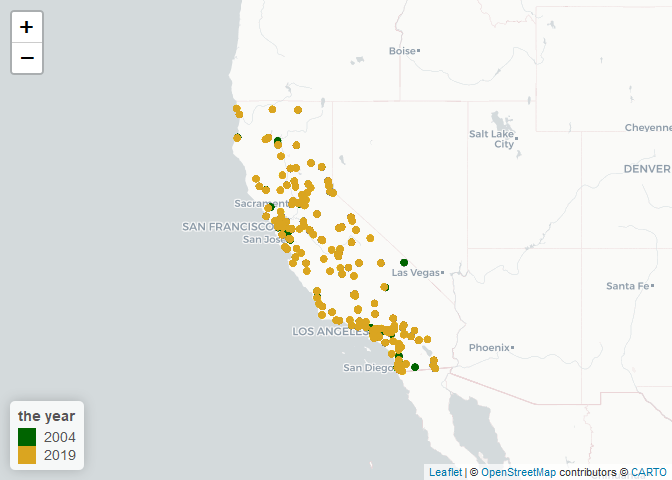
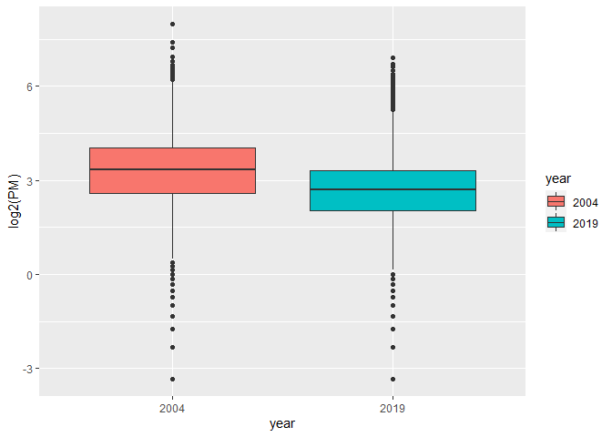
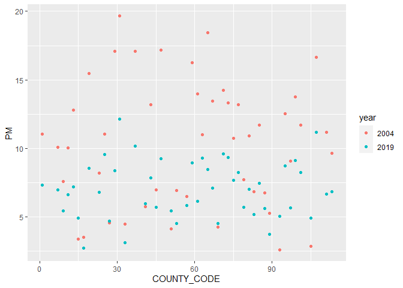
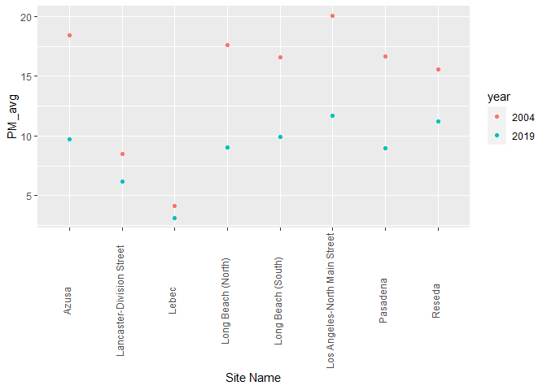

Assignment01
================
Yuwei Wu
2022-09-23

``` r
library(tidyverse)
```

    ## ── Attaching packages ─────────────────────────────────────── tidyverse 1.3.2 ──
    ## ✔ ggplot2 3.3.6      ✔ purrr   0.3.4 
    ## ✔ tibble  3.1.8      ✔ dplyr   1.0.10
    ## ✔ tidyr   1.2.0      ✔ stringr 1.4.1 
    ## ✔ readr   2.1.2      ✔ forcats 0.5.2 
    ## ── Conflicts ────────────────────────────────────────── tidyverse_conflicts() ──
    ## ✖ dplyr::filter() masks stats::filter()
    ## ✖ dplyr::lag()    masks stats::lag()

``` r
library(data.table)
```

    ## 
    ## 载入程辑包：'data.table'
    ## 
    ## The following objects are masked from 'package:dplyr':
    ## 
    ##     between, first, last
    ## 
    ## The following object is masked from 'package:purrr':
    ## 
    ##     transpose

# Step1.

## Read in data.

``` r
pm1 <- data.table::fread("ad_viz_plotval_data2004.csv")
pm2 <- data.table::fread("ad_viz_plotval_data2019.csv")
```

## Check the dimensions, headers, footers.

2004 dataset:

``` r
dim(pm1)
```

    ## [1] 19233    20

There are 19233 rows and 20 columns.

``` r
head(pm1)
```

    ##          Date Source  Site ID POC Daily Mean PM2.5 Concentration    UNITS
    ## 1: 01/01/2004    AQS 60010007   1                           11.0 ug/m3 LC
    ## 2: 01/02/2004    AQS 60010007   1                           12.2 ug/m3 LC
    ## 3: 01/03/2004    AQS 60010007   1                           16.5 ug/m3 LC
    ## 4: 01/04/2004    AQS 60010007   1                           19.5 ug/m3 LC
    ## 5: 01/05/2004    AQS 60010007   1                           11.5 ug/m3 LC
    ## 6: 01/06/2004    AQS 60010007   1                           32.5 ug/m3 LC
    ##    DAILY_AQI_VALUE Site Name DAILY_OBS_COUNT PERCENT_COMPLETE
    ## 1:              46 Livermore               1              100
    ## 2:              51 Livermore               1              100
    ## 3:              60 Livermore               1              100
    ## 4:              67 Livermore               1              100
    ## 5:              48 Livermore               1              100
    ## 6:              94 Livermore               1              100
    ##    AQS_PARAMETER_CODE                     AQS_PARAMETER_DESC CBSA_CODE
    ## 1:              88502 Acceptable PM2.5 AQI & Speciation Mass     41860
    ## 2:              88502 Acceptable PM2.5 AQI & Speciation Mass     41860
    ## 3:              88502 Acceptable PM2.5 AQI & Speciation Mass     41860
    ## 4:              88502 Acceptable PM2.5 AQI & Speciation Mass     41860
    ## 5:              88502 Acceptable PM2.5 AQI & Speciation Mass     41860
    ## 6:              88502 Acceptable PM2.5 AQI & Speciation Mass     41860
    ##                            CBSA_NAME STATE_CODE      STATE COUNTY_CODE  COUNTY
    ## 1: San Francisco-Oakland-Hayward, CA          6 California           1 Alameda
    ## 2: San Francisco-Oakland-Hayward, CA          6 California           1 Alameda
    ## 3: San Francisco-Oakland-Hayward, CA          6 California           1 Alameda
    ## 4: San Francisco-Oakland-Hayward, CA          6 California           1 Alameda
    ## 5: San Francisco-Oakland-Hayward, CA          6 California           1 Alameda
    ## 6: San Francisco-Oakland-Hayward, CA          6 California           1 Alameda
    ##    SITE_LATITUDE SITE_LONGITUDE
    ## 1:      37.68753      -121.7842
    ## 2:      37.68753      -121.7842
    ## 3:      37.68753      -121.7842
    ## 4:      37.68753      -121.7842
    ## 5:      37.68753      -121.7842
    ## 6:      37.68753      -121.7842

``` r
tail(pm1)
```

    ##          Date Source  Site ID POC Daily Mean PM2.5 Concentration    UNITS
    ## 1: 12/14/2004    AQS 61131003   1                             11 ug/m3 LC
    ## 2: 12/17/2004    AQS 61131003   1                             16 ug/m3 LC
    ## 3: 12/20/2004    AQS 61131003   1                             17 ug/m3 LC
    ## 4: 12/23/2004    AQS 61131003   1                              9 ug/m3 LC
    ## 5: 12/26/2004    AQS 61131003   1                             24 ug/m3 LC
    ## 6: 12/29/2004    AQS 61131003   1                              9 ug/m3 LC
    ##    DAILY_AQI_VALUE            Site Name DAILY_OBS_COUNT PERCENT_COMPLETE
    ## 1:              46 Woodland-Gibson Road               1              100
    ## 2:              59 Woodland-Gibson Road               1              100
    ## 3:              61 Woodland-Gibson Road               1              100
    ## 4:              38 Woodland-Gibson Road               1              100
    ## 5:              76 Woodland-Gibson Road               1              100
    ## 6:              38 Woodland-Gibson Road               1              100
    ##    AQS_PARAMETER_CODE       AQS_PARAMETER_DESC CBSA_CODE
    ## 1:              88101 PM2.5 - Local Conditions     40900
    ## 2:              88101 PM2.5 - Local Conditions     40900
    ## 3:              88101 PM2.5 - Local Conditions     40900
    ## 4:              88101 PM2.5 - Local Conditions     40900
    ## 5:              88101 PM2.5 - Local Conditions     40900
    ## 6:              88101 PM2.5 - Local Conditions     40900
    ##                                  CBSA_NAME STATE_CODE      STATE COUNTY_CODE
    ## 1: Sacramento--Roseville--Arden-Arcade, CA          6 California         113
    ## 2: Sacramento--Roseville--Arden-Arcade, CA          6 California         113
    ## 3: Sacramento--Roseville--Arden-Arcade, CA          6 California         113
    ## 4: Sacramento--Roseville--Arden-Arcade, CA          6 California         113
    ## 5: Sacramento--Roseville--Arden-Arcade, CA          6 California         113
    ## 6: Sacramento--Roseville--Arden-Arcade, CA          6 California         113
    ##    COUNTY SITE_LATITUDE SITE_LONGITUDE
    ## 1:   Yolo      38.66121      -121.7327
    ## 2:   Yolo      38.66121      -121.7327
    ## 3:   Yolo      38.66121      -121.7327
    ## 4:   Yolo      38.66121      -121.7327
    ## 5:   Yolo      38.66121      -121.7327
    ## 6:   Yolo      38.66121      -121.7327

2019 dataset:

``` r
dim(pm2)
```

    ## [1] 53156    20

There are 53156 rows and 20 columns.

``` r
head(pm2)
```

    ##          Date Source  Site ID POC Daily Mean PM2.5 Concentration    UNITS
    ## 1: 01/01/2019    AQS 60010007   3                            5.7 ug/m3 LC
    ## 2: 01/02/2019    AQS 60010007   3                           11.9 ug/m3 LC
    ## 3: 01/03/2019    AQS 60010007   3                           20.1 ug/m3 LC
    ## 4: 01/04/2019    AQS 60010007   3                           28.8 ug/m3 LC
    ## 5: 01/05/2019    AQS 60010007   3                           11.2 ug/m3 LC
    ## 6: 01/06/2019    AQS 60010007   3                            2.7 ug/m3 LC
    ##    DAILY_AQI_VALUE Site Name DAILY_OBS_COUNT PERCENT_COMPLETE
    ## 1:              24 Livermore               1              100
    ## 2:              50 Livermore               1              100
    ## 3:              68 Livermore               1              100
    ## 4:              86 Livermore               1              100
    ## 5:              47 Livermore               1              100
    ## 6:              11 Livermore               1              100
    ##    AQS_PARAMETER_CODE       AQS_PARAMETER_DESC CBSA_CODE
    ## 1:              88101 PM2.5 - Local Conditions     41860
    ## 2:              88101 PM2.5 - Local Conditions     41860
    ## 3:              88101 PM2.5 - Local Conditions     41860
    ## 4:              88101 PM2.5 - Local Conditions     41860
    ## 5:              88101 PM2.5 - Local Conditions     41860
    ## 6:              88101 PM2.5 - Local Conditions     41860
    ##                            CBSA_NAME STATE_CODE      STATE COUNTY_CODE  COUNTY
    ## 1: San Francisco-Oakland-Hayward, CA          6 California           1 Alameda
    ## 2: San Francisco-Oakland-Hayward, CA          6 California           1 Alameda
    ## 3: San Francisco-Oakland-Hayward, CA          6 California           1 Alameda
    ## 4: San Francisco-Oakland-Hayward, CA          6 California           1 Alameda
    ## 5: San Francisco-Oakland-Hayward, CA          6 California           1 Alameda
    ## 6: San Francisco-Oakland-Hayward, CA          6 California           1 Alameda
    ##    SITE_LATITUDE SITE_LONGITUDE
    ## 1:      37.68753      -121.7842
    ## 2:      37.68753      -121.7842
    ## 3:      37.68753      -121.7842
    ## 4:      37.68753      -121.7842
    ## 5:      37.68753      -121.7842
    ## 6:      37.68753      -121.7842

``` r
tail(pm2)
```

    ##          Date Source  Site ID POC Daily Mean PM2.5 Concentration    UNITS
    ## 1: 11/11/2019    AQS 61131003   1                           13.5 ug/m3 LC
    ## 2: 11/17/2019    AQS 61131003   1                           18.1 ug/m3 LC
    ## 3: 11/29/2019    AQS 61131003   1                           12.5 ug/m3 LC
    ## 4: 12/17/2019    AQS 61131003   1                           23.8 ug/m3 LC
    ## 5: 12/23/2019    AQS 61131003   1                            1.0 ug/m3 LC
    ## 6: 12/29/2019    AQS 61131003   1                            9.1 ug/m3 LC
    ##    DAILY_AQI_VALUE            Site Name DAILY_OBS_COUNT PERCENT_COMPLETE
    ## 1:              54 Woodland-Gibson Road               1              100
    ## 2:              64 Woodland-Gibson Road               1              100
    ## 3:              52 Woodland-Gibson Road               1              100
    ## 4:              76 Woodland-Gibson Road               1              100
    ## 5:               4 Woodland-Gibson Road               1              100
    ## 6:              38 Woodland-Gibson Road               1              100
    ##    AQS_PARAMETER_CODE       AQS_PARAMETER_DESC CBSA_CODE
    ## 1:              88101 PM2.5 - Local Conditions     40900
    ## 2:              88101 PM2.5 - Local Conditions     40900
    ## 3:              88101 PM2.5 - Local Conditions     40900
    ## 4:              88101 PM2.5 - Local Conditions     40900
    ## 5:              88101 PM2.5 - Local Conditions     40900
    ## 6:              88101 PM2.5 - Local Conditions     40900
    ##                                  CBSA_NAME STATE_CODE      STATE COUNTY_CODE
    ## 1: Sacramento--Roseville--Arden-Arcade, CA          6 California         113
    ## 2: Sacramento--Roseville--Arden-Arcade, CA          6 California         113
    ## 3: Sacramento--Roseville--Arden-Arcade, CA          6 California         113
    ## 4: Sacramento--Roseville--Arden-Arcade, CA          6 California         113
    ## 5: Sacramento--Roseville--Arden-Arcade, CA          6 California         113
    ## 6: Sacramento--Roseville--Arden-Arcade, CA          6 California         113
    ##    COUNTY SITE_LATITUDE SITE_LONGITUDE
    ## 1:   Yolo      38.66121      -121.7327
    ## 2:   Yolo      38.66121      -121.7327
    ## 3:   Yolo      38.66121      -121.7327
    ## 4:   Yolo      38.66121      -121.7327
    ## 5:   Yolo      38.66121      -121.7327
    ## 6:   Yolo      38.66121      -121.7327

## Take a look at the variables.

2004 dataset:

``` r
str(pm1)
```

    ## Classes 'data.table' and 'data.frame':   19233 obs. of  20 variables:
    ##  $ Date                          : chr  "01/01/2004" "01/02/2004" "01/03/2004" "01/04/2004" ...
    ##  $ Source                        : chr  "AQS" "AQS" "AQS" "AQS" ...
    ##  $ Site ID                       : int  60010007 60010007 60010007 60010007 60010007 60010007 60010007 60010007 60010007 60010007 ...
    ##  $ POC                           : int  1 1 1 1 1 1 1 1 1 1 ...
    ##  $ Daily Mean PM2.5 Concentration: num  11 12.2 16.5 19.5 11.5 32.5 14 29.9 21 15.7 ...
    ##  $ UNITS                         : chr  "ug/m3 LC" "ug/m3 LC" "ug/m3 LC" "ug/m3 LC" ...
    ##  $ DAILY_AQI_VALUE               : int  46 51 60 67 48 94 55 88 70 59 ...
    ##  $ Site Name                     : chr  "Livermore" "Livermore" "Livermore" "Livermore" ...
    ##  $ DAILY_OBS_COUNT               : int  1 1 1 1 1 1 1 1 1 1 ...
    ##  $ PERCENT_COMPLETE              : num  100 100 100 100 100 100 100 100 100 100 ...
    ##  $ AQS_PARAMETER_CODE            : int  88502 88502 88502 88502 88502 88502 88101 88502 88502 88101 ...
    ##  $ AQS_PARAMETER_DESC            : chr  "Acceptable PM2.5 AQI & Speciation Mass" "Acceptable PM2.5 AQI & Speciation Mass" "Acceptable PM2.5 AQI & Speciation Mass" "Acceptable PM2.5 AQI & Speciation Mass" ...
    ##  $ CBSA_CODE                     : int  41860 41860 41860 41860 41860 41860 41860 41860 41860 41860 ...
    ##  $ CBSA_NAME                     : chr  "San Francisco-Oakland-Hayward, CA" "San Francisco-Oakland-Hayward, CA" "San Francisco-Oakland-Hayward, CA" "San Francisco-Oakland-Hayward, CA" ...
    ##  $ STATE_CODE                    : int  6 6 6 6 6 6 6 6 6 6 ...
    ##  $ STATE                         : chr  "California" "California" "California" "California" ...
    ##  $ COUNTY_CODE                   : int  1 1 1 1 1 1 1 1 1 1 ...
    ##  $ COUNTY                        : chr  "Alameda" "Alameda" "Alameda" "Alameda" ...
    ##  $ SITE_LATITUDE                 : num  37.7 37.7 37.7 37.7 37.7 ...
    ##  $ SITE_LONGITUDE                : num  -122 -122 -122 -122 -122 ...
    ##  - attr(*, ".internal.selfref")=<externalptr>

2019 dataset:

``` r
str(pm2)
```

    ## Classes 'data.table' and 'data.frame':   53156 obs. of  20 variables:
    ##  $ Date                          : chr  "01/01/2019" "01/02/2019" "01/03/2019" "01/04/2019" ...
    ##  $ Source                        : chr  "AQS" "AQS" "AQS" "AQS" ...
    ##  $ Site ID                       : int  60010007 60010007 60010007 60010007 60010007 60010007 60010007 60010007 60010007 60010007 ...
    ##  $ POC                           : int  3 3 3 3 3 3 3 3 3 3 ...
    ##  $ Daily Mean PM2.5 Concentration: num  5.7 11.9 20.1 28.8 11.2 2.7 2.8 7 3.1 7.1 ...
    ##  $ UNITS                         : chr  "ug/m3 LC" "ug/m3 LC" "ug/m3 LC" "ug/m3 LC" ...
    ##  $ DAILY_AQI_VALUE               : int  24 50 68 86 47 11 12 29 13 30 ...
    ##  $ Site Name                     : chr  "Livermore" "Livermore" "Livermore" "Livermore" ...
    ##  $ DAILY_OBS_COUNT               : int  1 1 1 1 1 1 1 1 1 1 ...
    ##  $ PERCENT_COMPLETE              : num  100 100 100 100 100 100 100 100 100 100 ...
    ##  $ AQS_PARAMETER_CODE            : int  88101 88101 88101 88101 88101 88101 88101 88101 88101 88101 ...
    ##  $ AQS_PARAMETER_DESC            : chr  "PM2.5 - Local Conditions" "PM2.5 - Local Conditions" "PM2.5 - Local Conditions" "PM2.5 - Local Conditions" ...
    ##  $ CBSA_CODE                     : int  41860 41860 41860 41860 41860 41860 41860 41860 41860 41860 ...
    ##  $ CBSA_NAME                     : chr  "San Francisco-Oakland-Hayward, CA" "San Francisco-Oakland-Hayward, CA" "San Francisco-Oakland-Hayward, CA" "San Francisco-Oakland-Hayward, CA" ...
    ##  $ STATE_CODE                    : int  6 6 6 6 6 6 6 6 6 6 ...
    ##  $ STATE                         : chr  "California" "California" "California" "California" ...
    ##  $ COUNTY_CODE                   : int  1 1 1 1 1 1 1 1 1 1 ...
    ##  $ COUNTY                        : chr  "Alameda" "Alameda" "Alameda" "Alameda" ...
    ##  $ SITE_LATITUDE                 : num  37.7 37.7 37.7 37.7 37.7 ...
    ##  $ SITE_LONGITUDE                : num  -122 -122 -122 -122 -122 ...
    ##  - attr(*, ".internal.selfref")=<externalptr>

## Take a closer look at the key variables.

I choose to check the Date, State, County, Site Name, Daily Mean PM2.5
Concentration variables to see if there have any missing or implausible
values.

2004 dataset:

``` r
table(pm1$Date)
```

    ## 
    ## 01/01/2004 01/02/2004 01/03/2004 01/04/2004 01/05/2004 01/06/2004 01/07/2004 
    ##         80         23         22        108         19         22         89 
    ## 01/08/2004 01/09/2004 01/10/2004 01/11/2004 01/12/2004 01/13/2004 01/14/2004 
    ##         26         25        128         25         24         96         23 
    ## 01/15/2004 01/16/2004 01/17/2004 01/18/2004 01/19/2004 01/20/2004 01/21/2004 
    ##         23        116         25         26         80         20         22 
    ## 01/22/2004 01/23/2004 01/24/2004 01/25/2004 01/26/2004 01/27/2004 01/28/2004 
    ##        123         23         24         88         23         24        122 
    ## 01/29/2004 01/30/2004 01/31/2004 02/01/2004 02/02/2004 02/03/2004 02/04/2004 
    ##         28         26         90         24         23        121         20 
    ## 02/05/2004 02/06/2004 02/07/2004 02/08/2004 02/09/2004 02/10/2004 02/11/2004 
    ##         23         82         25         24        120         21         25 
    ## 02/12/2004 02/13/2004 02/14/2004 02/15/2004 02/16/2004 02/17/2004 02/18/2004 
    ##         86         23         25        120         22         21         83 
    ## 02/19/2004 02/20/2004 02/21/2004 02/22/2004 02/23/2004 02/24/2004 02/25/2004 
    ##         21         23        122         24         23         91         22 
    ## 02/26/2004 02/27/2004 02/28/2004 02/29/2004 03/01/2004 03/02/2004 03/03/2004 
    ##         24        115         26         25         81         23         24 
    ## 03/04/2004 03/05/2004 03/06/2004 03/07/2004 03/08/2004 03/09/2004 03/10/2004 
    ##        128         25         26         91         24         24        117 
    ## 03/11/2004 03/12/2004 03/13/2004 03/14/2004 03/15/2004 03/16/2004 03/17/2004 
    ##         21         21         86         24         22        122         21 
    ## 03/18/2004 03/19/2004 03/20/2004 03/21/2004 03/22/2004 03/23/2004 03/24/2004 
    ##         25         92         25         25        124         23         24 
    ## 03/25/2004 03/26/2004 03/27/2004 03/28/2004 03/29/2004 03/30/2004 03/31/2004 
    ##         91         24         23        127         23         22         86 
    ## 04/01/2004 04/02/2004 04/03/2004 04/04/2004 04/05/2004 04/06/2004 04/07/2004 
    ##         19         20        123         18         16         84         19 
    ## 04/08/2004 04/09/2004 04/10/2004 04/11/2004 04/12/2004 04/13/2004 04/14/2004 
    ##         21        117         21         21         71         18         17 
    ## 04/15/2004 04/16/2004 04/17/2004 04/18/2004 04/19/2004 04/20/2004 04/21/2004 
    ##        123         17         18         79         17         19        125 
    ## 04/22/2004 04/23/2004 04/24/2004 04/25/2004 04/26/2004 04/27/2004 04/28/2004 
    ##         20         19         82         20         20        126         21 
    ## 04/29/2004 04/30/2004 05/01/2004 05/02/2004 05/03/2004 05/04/2004 05/05/2004 
    ##         20         83         19         20        123         17         18 
    ## 05/06/2004 05/07/2004 05/08/2004 05/09/2004 05/10/2004 05/11/2004 05/12/2004 
    ##         82         19         19        126         18         19         85 
    ## 05/13/2004 05/14/2004 05/15/2004 05/16/2004 05/17/2004 05/18/2004 05/19/2004 
    ##         21         20        125         20         18         86         18 
    ## 05/20/2004 05/21/2004 05/22/2004 05/23/2004 05/24/2004 05/25/2004 05/26/2004 
    ##         17        120         22         20         74         20         23 
    ## 05/27/2004 05/28/2004 05/29/2004 05/30/2004 05/31/2004 06/01/2004 06/02/2004 
    ##        125         20         22         82         22         21        130 
    ## 06/03/2004 06/04/2004 06/05/2004 06/06/2004 06/07/2004 06/08/2004 06/09/2004 
    ##         22         21         88         22         21        127         22 
    ## 06/10/2004 06/11/2004 06/12/2004 06/13/2004 06/14/2004 06/15/2004 06/16/2004 
    ##         21         82         22         22        113         20         26 
    ## 06/17/2004 06/18/2004 06/19/2004 06/20/2004 06/21/2004 06/22/2004 06/23/2004 
    ##         91         25         28        133         26         26         92 
    ## 06/24/2004 06/25/2004 06/26/2004 06/27/2004 06/28/2004 06/29/2004 06/30/2004 
    ##         31         27        138         28         28         95         31 
    ## 07/01/2004 07/02/2004 07/03/2004 07/04/2004 07/05/2004 07/06/2004 07/07/2004 
    ##         27        124         29         27         87         26         28 
    ## 07/08/2004 07/09/2004 07/10/2004 07/11/2004 07/12/2004 07/13/2004 07/14/2004 
    ##        130         25         26         93         23         26        130 
    ## 07/15/2004 07/16/2004 07/17/2004 07/18/2004 07/19/2004 07/20/2004 07/21/2004 
    ##         29         26         91         25         25        129         28 
    ## 07/22/2004 07/23/2004 07/24/2004 07/25/2004 07/26/2004 07/27/2004 07/28/2004 
    ##         26         85         29         27        128         23         24 
    ## 07/29/2004 07/30/2004 07/31/2004 08/01/2004 08/02/2004 08/03/2004 08/04/2004 
    ##         80         22         23        121         22         26         87 
    ## 08/05/2004 08/06/2004 08/07/2004 08/08/2004 08/09/2004 08/10/2004 08/11/2004 
    ##         25         25        128         24         24         89         25 
    ## 08/12/2004 08/13/2004 08/14/2004 08/15/2004 08/16/2004 08/17/2004 08/18/2004 
    ##         23        114         24         25         83         24         25 
    ## 08/19/2004 08/20/2004 08/21/2004 08/22/2004 08/23/2004 08/24/2004 08/25/2004 
    ##        124         26         27         86         24         26        131 
    ## 08/26/2004 08/27/2004 08/28/2004 08/29/2004 08/30/2004 08/31/2004 09/01/2004 
    ##         24         27         87         28         28        122         27 
    ## 09/02/2004 09/03/2004 09/04/2004 09/05/2004 09/06/2004 09/07/2004 09/08/2004 
    ##         26         89         27         27        128         25         27 
    ## 09/09/2004 09/10/2004 09/11/2004 09/12/2004 09/13/2004 09/14/2004 09/15/2004 
    ##         84         25         27        134         28         27         89 
    ## 09/16/2004 09/17/2004 09/18/2004 09/19/2004 09/20/2004 09/21/2004 09/22/2004 
    ##         28         26        136         27         26         93         26 
    ## 09/23/2004 09/24/2004 09/25/2004 09/26/2004 09/27/2004 09/28/2004 09/29/2004 
    ##         27        126         26         27         86         25         30 
    ## 09/30/2004 10/01/2004 10/02/2004 10/03/2004 10/04/2004 10/05/2004 10/06/2004 
    ##        126         29         29         98         31         30        129 
    ## 10/07/2004 10/08/2004 10/09/2004 10/10/2004 10/11/2004 10/12/2004 10/13/2004 
    ##         34         33        100         32         31        129         32 
    ## 10/14/2004 10/15/2004 10/16/2004 10/17/2004 10/18/2004 10/19/2004 10/20/2004 
    ##         33         99         34         32        124         32         31 
    ## 10/21/2004 10/22/2004 10/23/2004 10/24/2004 10/25/2004 10/26/2004 10/27/2004 
    ##         95         29         30        127         29         31         90 
    ## 10/28/2004 10/29/2004 10/30/2004 10/31/2004 11/01/2004 11/02/2004 11/03/2004 
    ##         32         30        133         31         28         91         33 
    ## 11/04/2004 11/05/2004 11/06/2004 11/07/2004 11/08/2004 11/09/2004 11/10/2004 
    ##         30        117         34         30         95         31         31 
    ## 11/11/2004 11/12/2004 11/13/2004 11/14/2004 11/15/2004 11/16/2004 11/17/2004 
    ##        136         31         31         99         31         33        127 
    ## 11/18/2004 11/19/2004 11/20/2004 11/21/2004 11/22/2004 11/23/2004 11/24/2004 
    ##         32         33        102         32         32        129         31 
    ## 11/25/2004 11/26/2004 11/27/2004 11/28/2004 11/29/2004 11/30/2004 12/01/2004 
    ##         33         99         31         30        121         30         31 
    ## 12/02/2004 12/03/2004 12/04/2004 12/05/2004 12/06/2004 12/07/2004 12/08/2004 
    ##         92         29         34        125         31         33         91 
    ## 12/09/2004 12/10/2004 12/11/2004 12/12/2004 12/13/2004 12/14/2004 12/15/2004 
    ##         34         32        131         30         30        106         31 
    ## 12/16/2004 12/17/2004 12/18/2004 12/19/2004 12/20/2004 12/21/2004 12/22/2004 
    ##         30        115         33         31         95         32         29 
    ## 12/23/2004 12/24/2004 12/25/2004 12/26/2004 12/27/2004 12/28/2004 12/29/2004 
    ##        130         30         33         90         31         32        129 
    ## 12/30/2004 12/31/2004 
    ##         32         35

``` r
table(pm1$STATE)
```

    ## 
    ## California 
    ##      19233

``` r
table(pm1$COUNTY)
```

    ## 
    ##         Alameda           Butte       Calaveras          Colusa    Contra Costa 
    ##             458             444              61             201             259 
    ##       Del Norte       El Dorado          Fresno        Humboldt        Imperial 
    ##             117             128             811              58             366 
    ##            Inyo            Kern           Kings            Lake     Los Angeles 
    ##             247            1304              84              60            2243 
    ##           Marin        Mariposa       Mendocino          Merced            Mono 
    ##             120             320              61              90             181 
    ##        Monterey          Nevada          Orange          Placer          Plumas 
    ##              60             232             529             246             258 
    ##       Riverside      Sacramento      San Benito  San Bernardino       San Diego 
    ##            1203            1453             122             893            1431 
    ##   San Francisco     San Joaquin San Luis Obispo       San Mateo   Santa Barbara 
    ##             560             122             176             354             225 
    ##     Santa Clara      Santa Cruz          Shasta        Siskiyou          Solano 
    ##             660              56             181             117             361 
    ##          Sonoma      Stanislaus          Sutter         Trinity          Tulare 
    ##              92             183             309             115             627 
    ##         Ventura            Yolo 
    ##             580             475

``` r
table(pm1$`Site Name`)
```

    ## 
    ##                                                   
    ##                                               229 
    ##                           3425 N FIRST ST, FRESNO 
    ##                                               521 
    ##                                           Anaheim 
    ##                                               418 
    ##                             Aqua Tibia Wilderness 
    ##                                               109 
    ##                        Atascadero (original site) 
    ##                                               117 
    ##                                             Azusa 
    ##                                               279 
    ##                       Bakersfield-Airport (Planz) 
    ##                                               100 
    ##                            Bakersfield-California 
    ##                                               850 
    ##                         Bakersfield-Golden / M St 
    ##                                                88 
    ##                                          Big Bear 
    ##                                                52 
    ##                                          Bliss SP 
    ##                                               119 
    ##                           Brawley-220 Main Street 
    ##                                                99 
    ##                                           Burbank 
    ##                                               109 
    ##                             Calexico-Ethel Street 
    ##                                               162 
    ##                              Chico-Manzanita Ave. 
    ##                                               122 
    ##                                       Chula Vista 
    ##                                               113 
    ##                                      Clovis-Villa 
    ##                                                90 
    ##                               Colusa-Sunrise Blvd 
    ##                                               201 
    ##                                           Concord 
    ##                                               259 
    ##                                Corcoran-Patterson 
    ##                                                84 
    ##                                  Davis-UCD Campus 
    ##                                               359 
    ##                    Death Valley NP - Park Village 
    ##                                               119 
    ##                                          El Cajon 
    ##                                               438 
    ##                              El Centro-9th Street 
    ##                                               105 
    ##                         El Rio-Rio Mesa School #2 
    ##                                               117 
    ##                                         Escondido 
    ##                                               412 
    ##                                   Eureka I Street 
    ##                                                58 
    ##                                           Fontana 
    ##                                               199 
    ##                              Fremont - Chapel Way 
    ##                                                94 
    ##                                    Fresno-Pacific 
    ##                                                90 
    ##                      Grass Valley-Litton Building 
    ##                                                56 
    ##                                 Hoover Wilderness 
    ##                                               122 
    ##                                             Indio 
    ##                                               161 
    ##                       Joshua Tree NP - Black Rock 
    ##                                               121 
    ##                                 Kaiser Wilderness 
    ##                                               110 
    ##                                       Kearny Mesa 
    ##                                               108 
    ##                                            Keeler 
    ##                                               128 
    ##                              La Posta Reservation 
    ##                                                23 
    ##                           Lakeport-Lakeport Blvd. 
    ##                                                60 
    ##                         Lancaster-Division Street 
    ##                                               111 
    ##  Lassen Volcanic NP - Manzanita Lake Fire Station 
    ##                                               110 
    ##                       Lava Beds National Monument 
    ##                                               117 
    ##                                             Lebec 
    ##                                               115 
    ##                           Lebec-Peace Valley Road 
    ##                                               107 
    ##                                         Livermore 
    ##                                               364 
    ##                                Long Beach (North) 
    ##                                               325 
    ##                                Long Beach (South) 
    ##                                               327 
    ##                     Los Angeles-North Main Street 
    ##                                               535 
    ##                                           Lynwood 
    ##                                               115 
    ##                                           Mammoth 
    ##                                                59 
    ##                                       Merced-M St 
    ##                                                90 
    ##                                     Mission Viejo 
    ##                                               111 
    ##                               Modesto-14th Street 
    ##                                               183 
    ##                                            Mojave 
    ##                                                63 
    ##                              Ontario Fire Station 
    ##                                               112 
    ##                                      Palm Springs 
    ##                                               112 
    ##                                          Pasadena 
    ##                                               113 
    ## Pinnacles NP - Southwest of East Entrance Station 
    ##                                               122 
    ##                                    Piru - Pacific 
    ##                                               111 
    ##                     Point Reyes NS Ranger Station 
    ##                                               120 
    ##                         Portola-161 Nevada Street 
    ##                                               181 
    ##                            Quincy-N Church Street 
    ##                                                77 
    ##                                 Redding - Buckeye 
    ##                                                 6 
    ##                       Redding - Health Department 
    ##                                                58 
    ##                                   Redding - Toyon 
    ##                                                 7 
    ##                                      Redwood City 
    ##                                               354 
    ##                                        Redwood NP 
    ##                                               117 
    ##                                            Reseda 
    ##                                               106 
    ##                         Ridgecrest-California Ave 
    ##                                                96 
    ##                              Riverside (Magnolia) 
    ##                                               110 
    ##                           Roseville-N Sunrise Ave 
    ##                                               246 
    ##                                          Rubidoux 
    ##                                               711 
    ##                          Sacramento-1309 T Street 
    ##                                               806 
    ##                         Sacramento-Del Paso Manor 
    ##                                               414 
    ##       Sacramento Health Department-Stockton Blvd. 
    ##                                               233 
    ##                                         Salinas 3 
    ##                                                60 
    ##                      San Andreas-Gold Strike Road 
    ##                                                61 
    ##                                    San Bernardino 
    ##                                               106 
    ##                                San Diego-12th Ave 
    ##                                               337 
    ##                                     San Francisco 
    ##                                               363 
    ##             San Francisco - Bayview Hunters Point 
    ##                                               197 
    ##                                          San Jose 
    ##                                               213 
    ##                                San Jose - Jackson 
    ##                                               447 
    ##                         San Luis Obispo-Marsh St. 
    ##                                                59 
    ##                             San Rafael Wilderness 
    ##                                               112 
    ##                                     Santa Barbara 
    ##                                                55 
    ##                                        Santa Cruz 
    ##                                                56 
    ##                                       Santa Maria 
    ##                                                58 
    ##                               Santa Rosa - 5th St 
    ##                                                92 
    ##                           Sequoia NP-Ash Mountain 
    ##                                               112 
    ##                        Simi Valley-Cochran Street 
    ##                                               172 
    ##                        South Lake Tahoe-Sandy Way 
    ##                                                 9 
    ##                                 Stockton-Hazelton 
    ##                                               122 
    ##                                     Thousand Oaks 
    ##                                               180 
    ##                         TRAFFIC, RURAL PAVED ROAD 
    ##                                               322 
    ##                                           Trinity 
    ##                                               115 
    ##                              Truckee-Fire Station 
    ##                                               176 
    ##                                     Ukiah-Library 
    ##                                                61 
    ##                                           Vallejo 
    ##                                               361 
    ##                           Victorville-Park Avenue 
    ##                                               182 
    ##                                    Visalia-Church 
    ##                                               515 
    ##                              Woodland-Gibson Road 
    ##                                               116 
    ##        Yosemite NP-Yosemite Village Vistor Center 
    ##                                               210 
    ##                     Yosemite NP - Turtleback Dome 
    ##                                               110 
    ##                                         Yuba City 
    ##                                               309

``` r
summary(pm1$`Daily Mean PM2.5 Concentration`)
```

    ##    Min. 1st Qu.  Median    Mean 3rd Qu.    Max. 
    ##   -0.10    6.00   10.10   13.13   16.30  251.00

In 2004, the minimum PM2.5 concentration is -0.1 μg/m³, the maximum
PM2.5 concentration is 251 μg/m³, the median is 10.1 μg/m³, and the mean
is 16.3 μg/m³ in California.

It looks like the PM2.5 concentration are in μg/m³. A PM2.5
concentration of -0.1 is like an implausible value. All the value of
PM2.5 concentration should be positive number. And it looks like there
are no missing data in 2004.

Let us check the proportion of PM2.5 concentration less than 0.

``` r
mean(pm1$`Daily Mean PM2.5 Concentration`<0)
```

    ## [1] 5.199397e-05

Just very few data are less than 0.

Then remove PM2.5 concentration less than 0.

``` r
pm1 <- pm1[`Daily Mean PM2.5 Concentration` >= 0]
```

2019 dataset:

``` r
table(pm2$Date)
```

    ## 
    ## 01/01/2019 01/02/2019 01/03/2019 01/04/2019 01/05/2019 01/06/2019 01/07/2019 
    ##        124        116        180        124        123        152        121 
    ## 01/08/2019 01/09/2019 01/10/2019 01/11/2019 01/12/2019 01/13/2019 01/14/2019 
    ##        119        185        120        116        156        121        121 
    ## 01/15/2019 01/16/2019 01/17/2019 01/18/2019 01/19/2019 01/20/2019 01/21/2019 
    ##        183        124        124        155        124        121        187 
    ## 01/22/2019 01/23/2019 01/24/2019 01/25/2019 01/26/2019 01/27/2019 01/28/2019 
    ##        118        120        158        123        123        187        121 
    ## 01/29/2019 01/30/2019 01/31/2019 02/01/2019 02/02/2019 02/03/2019 02/04/2019 
    ##        123        166        123        125        197        122        122 
    ## 02/05/2019 02/06/2019 02/07/2019 02/08/2019 02/09/2019 02/10/2019 02/11/2019 
    ##        164        122        123        185        127        124        166 
    ## 02/12/2019 02/13/2019 02/14/2019 02/15/2019 02/16/2019 02/17/2019 02/18/2019 
    ##        125        126        198        126        128        168        125 
    ## 02/19/2019 02/20/2019 02/21/2019 02/22/2019 02/23/2019 02/24/2019 02/25/2019 
    ##        127        185        123        124        170        124        123 
    ## 02/26/2019 02/27/2019 02/28/2019 03/01/2019 03/02/2019 03/03/2019 03/04/2019 
    ##        197        123        120        168        127        129        198 
    ## 03/05/2019 03/06/2019 03/07/2019 03/08/2019 03/09/2019 03/10/2019 03/11/2019 
    ##        125        126        165        126        127        203        127 
    ## 03/12/2019 03/13/2019 03/14/2019 03/15/2019 03/16/2019 03/17/2019 03/18/2019 
    ##        131        174        125        123        192        124        122 
    ## 03/19/2019 03/20/2019 03/21/2019 03/22/2019 03/23/2019 03/24/2019 03/25/2019 
    ##        176        126        125        204        130        128        172 
    ## 03/26/2019 03/27/2019 03/28/2019 03/29/2019 03/30/2019 03/31/2019 04/01/2019 
    ##        130        130        197        129        129        177        130 
    ## 04/02/2019 04/03/2019 04/04/2019 04/05/2019 04/06/2019 04/07/2019 04/08/2019 
    ##        126        205        132        130        176        131        128 
    ## 04/09/2019 04/10/2019 04/11/2019 04/12/2019 04/13/2019 04/14/2019 04/15/2019 
    ##        195        127        123        170        130        130        205 
    ## 04/16/2019 04/17/2019 04/18/2019 04/19/2019 04/20/2019 04/21/2019 04/22/2019 
    ##        130        130        175        131        130        202        133 
    ## 04/23/2019 04/24/2019 04/25/2019 04/26/2019 04/27/2019 04/28/2019 04/29/2019 
    ##        133        174        130        127        208        125        125 
    ## 04/30/2019 05/01/2019 05/02/2019 05/03/2019 05/04/2019 05/05/2019 05/06/2019 
    ##        172        128        127        193        127        127        176 
    ## 05/07/2019 05/08/2019 05/09/2019 05/10/2019 05/11/2019 05/12/2019 05/13/2019 
    ##        128        127        206        126        127        174        122 
    ## 05/14/2019 05/15/2019 05/16/2019 05/17/2019 05/18/2019 05/19/2019 05/20/2019 
    ##        125        198        128        125        176        127        127 
    ## 05/21/2019 05/22/2019 05/23/2019 05/24/2019 05/25/2019 05/26/2019 05/27/2019 
    ##        208        128        129        178        131        130        203 
    ## 05/28/2019 05/29/2019 05/30/2019 05/31/2019 06/01/2019 06/02/2019 06/03/2019 
    ##        128        129        174        127        129        209        127 
    ## 06/04/2019 06/05/2019 06/06/2019 06/07/2019 06/08/2019 06/09/2019 06/10/2019 
    ##        127        175        127        129        198        127        124 
    ## 06/11/2019 06/12/2019 06/13/2019 06/14/2019 06/15/2019 06/16/2019 06/17/2019 
    ##        176        131        129        205        136        131        174 
    ## 06/18/2019 06/19/2019 06/20/2019 06/21/2019 06/22/2019 06/23/2019 06/24/2019 
    ##        131        129        195        125        128        172        128 
    ## 06/25/2019 06/26/2019 06/27/2019 06/28/2019 06/29/2019 06/30/2019 07/01/2019 
    ##        130        206        130        131        177        131        131 
    ## 07/02/2019 07/03/2019 07/04/2019 07/05/2019 07/06/2019 07/07/2019 07/08/2019 
    ##        202        132        132        181        133        132        207 
    ## 07/09/2019 07/10/2019 07/11/2019 07/12/2019 07/13/2019 07/14/2019 07/15/2019 
    ##        131        131        178        130        131        205        127 
    ## 07/16/2019 07/17/2019 07/18/2019 07/19/2019 07/20/2019 07/21/2019 07/22/2019 
    ##        131        178        129        129        213        130        125 
    ## 07/23/2019 07/24/2019 07/25/2019 07/26/2019 07/27/2019 07/28/2019 07/29/2019 
    ##        174        126        127        198        130        130        172 
    ## 07/30/2019 07/31/2019 08/01/2019 08/02/2019 08/03/2019 08/04/2019 08/05/2019 
    ##        133        129        205        128        129        177        124 
    ## 08/06/2019 08/07/2019 08/08/2019 08/09/2019 08/10/2019 08/11/2019 08/12/2019 
    ##        128        197        125        128        173        129        127 
    ## 08/13/2019 08/14/2019 08/15/2019 08/16/2019 08/17/2019 08/18/2019 08/19/2019 
    ##        207        128        130        171        128        127        199 
    ## 08/20/2019 08/21/2019 08/22/2019 08/23/2019 08/24/2019 08/25/2019 08/26/2019 
    ##        127        130        167        130        126        204        122 
    ## 08/27/2019 08/28/2019 08/29/2019 08/30/2019 08/31/2019 09/01/2019 09/02/2019 
    ##        127        170        124        128        193        129        127 
    ## 09/03/2019 09/04/2019 09/05/2019 09/06/2019 09/07/2019 09/08/2019 09/09/2019 
    ##        166        123        126        207        128        125        170 
    ## 09/10/2019 09/11/2019 09/12/2019 09/13/2019 09/14/2019 09/15/2019 09/16/2019 
    ##        125        123        198        129        126        174        120 
    ## 09/17/2019 09/18/2019 09/19/2019 09/20/2019 09/21/2019 09/22/2019 09/23/2019 
    ##        121        203        123        119        172        123        124 
    ## 09/24/2019 09/25/2019 09/26/2019 09/27/2019 09/28/2019 09/29/2019 09/30/2019 
    ##        195        124        127        177        128        127        205 
    ## 10/01/2019 10/02/2019 10/03/2019 10/04/2019 10/05/2019 10/06/2019 10/07/2019 
    ##        126        126        171        128        126        201        125 
    ## 10/08/2019 10/09/2019 10/10/2019 10/11/2019 10/12/2019 10/13/2019 10/14/2019 
    ##        126        164        117        122        206        124        123 
    ## 10/15/2019 10/16/2019 10/17/2019 10/18/2019 10/19/2019 10/20/2019 10/21/2019 
    ##        175        128        125        194        124        126        169 
    ## 10/22/2019 10/23/2019 10/24/2019 10/25/2019 10/26/2019 10/27/2019 10/28/2019 
    ##        124        124        205        127        125        153        112 
    ## 10/29/2019 10/30/2019 10/31/2019 11/01/2019 11/02/2019 11/03/2019 11/04/2019 
    ##        118        182        123        128        176        129        127 
    ## 11/05/2019 11/06/2019 11/07/2019 11/08/2019 11/09/2019 11/10/2019 11/11/2019 
    ##        206        128        127        174        128        129        200 
    ## 11/12/2019 11/13/2019 11/14/2019 11/15/2019 11/16/2019 11/17/2019 11/18/2019 
    ##        127        126        177        124        124        207        123 
    ## 11/19/2019 11/20/2019 11/21/2019 11/22/2019 11/23/2019 11/24/2019 11/25/2019 
    ##        125        165        126        128        198        127        126 
    ## 11/26/2019 11/27/2019 11/28/2019 11/29/2019 11/30/2019 12/01/2019 12/02/2019 
    ##        168        128        126        203        127        123        168 
    ## 12/03/2019 12/04/2019 12/05/2019 12/06/2019 12/07/2019 12/08/2019 12/09/2019 
    ##        126        126        190        120        120        167        117 
    ## 12/10/2019 12/11/2019 12/12/2019 12/13/2019 12/14/2019 12/15/2019 12/16/2019 
    ##        119        201        122        117        169        121        120 
    ## 12/17/2019 12/18/2019 12/19/2019 12/20/2019 12/21/2019 12/22/2019 12/23/2019 
    ##        191        125        129        174        129        128        207 
    ## 12/24/2019 12/25/2019 12/26/2019 12/27/2019 12/28/2019 12/29/2019 12/30/2019 
    ##        129        129        165        123        123        196        120 
    ## 12/31/2019 
    ##        126

``` r
table(pm2$STATE)
```

    ## 
    ## California 
    ##      53156

``` r
table(pm2$COUNTY)
```

    ## 
    ##         Alameda           Butte       Calaveras          Colusa    Contra Costa 
    ##            2137            1254             338             728             811 
    ##       Del Norte       El Dorado          Fresno           Glenn        Humboldt 
    ##             309             177            2671             356             107 
    ##        Imperial            Inyo            Kern           Kings            Lake 
    ##            1006             902            2084             805              60 
    ##     Los Angeles          Madera           Marin        Mariposa       Mendocino 
    ##            4918             357             457             536             713 
    ##          Merced            Mono        Monterey            Napa          Nevada 
    ##             479             890            1126             355             526 
    ##          Orange          Placer          Plumas       Riverside      Sacramento 
    ##             883            1685             530            4368            2134 
    ##      San Benito  San Bernardino       San Diego   San Francisco     San Joaquin 
    ##             466            2617            2155             359            1307 
    ## San Luis Obispo       San Mateo   Santa Barbara     Santa Clara      Santa Cruz 
    ##            1419             344            1518            1200             697 
    ##          Shasta        Siskiyou          Solano          Sonoma      Stanislaus 
    ##             146             458             716             343             798 
    ##          Sutter          Tehama         Trinity          Tulare         Ventura 
    ##             708             353             345             975            2125 
    ##            Yolo 
    ##             405

``` r
table(pm2$`Site Name`)
```

    ## 
    ##                                                   
    ##                                               102 
    ##                                          29 Palms 
    ##                                               300 
    ##                                            Alpine 
    ##                                               350 
    ##                                           Anaheim 
    ##                                               772 
    ##                             Aqua Tibia Wilderness 
    ##                                                86 
    ##                                 Arroyo Grande CDF 
    ##                                               356 
    ##                                        Atascadero 
    ##                                               359 
    ##                                     Auburn-Atwood 
    ##                                               353 
    ##                                             Azusa 
    ##                                               121 
    ##                       Bakersfield-Airport (Planz) 
    ##                                               115 
    ##                            Bakersfield-California 
    ##                                               748 
    ##                         Bakersfield-Golden / M St 
    ##                                               121 
    ##                                   Banning Airport 
    ##                                               365 
    ##                            Berkeley- Aquatic Park 
    ##                                               352 
    ##                                          Big Bear 
    ##                                                46 
    ##                                          Bliss SP 
    ##                                                61 
    ##                           Brawley-220 Main Street 
    ##                                               117 
    ##                             Calexico-Ethel Street 
    ##                                               773 
    ##                                    Camp Pendleton 
    ##                                               280 
    ##                                     Carmel Valley 
    ##                                               358 
    ##                                 Chico-East Avenue 
    ##                                               555 
    ##                                       Chula Vista 
    ##                                               116 
    ##                                      Clovis-Villa 
    ##                                               278 
    ##                                  Colfax-City Hall 
    ##                                               294 
    ##                               Colusa-Sunrise Blvd 
    ##                                               423 
    ##                                           Compton 
    ##                                               303 
    ##                                           Concord 
    ##                                               460 
    ##                                Corcoran-Patterson 
    ##                                               456 
    ##                          Cortina Indian Rancheria 
    ##                                               305 
    ##                 Crescent City-Crescent Elk School 
    ##                                               195 
    ##                                         Crestline 
    ##                                               344 
    ##                                  Davis-UCD Campus 
    ##                                               352 
    ##                                           Donovan 
    ##                                               327 
    ##            El Cajon - Lexington Elementary School 
    ##                                               364 
    ##                              El Centro-9th Street 
    ##                                               116 
    ##                         El Rio-Rio Mesa School #2 
    ##                                               344 
    ##                                 Folsom-Natoma St. 
    ##                                               399 
    ##                                           Fontana 
    ##                                               175 
    ##                                    Fresno-Pacific 
    ##                                               114 
    ##                                  Fresno - Garland 
    ##                                              1118 
    ##                                            Gilroy 
    ##                                               360 
    ##                                          Glendora 
    ##                                               360 
    ##                                            Goleta 
    ##                                               361 
    ##                      Grass Valley-Litton Building 
    ##                                               414 
    ##                                     Hanford-Irwin 
    ##                                               349 
    ##                                         Hollister 
    ##                                               356 
    ##                                 Hoover Wilderness 
    ##                                               101 
    ##                                             Huron 
    ##                                               354 
    ##                                             Indio 
    ##                                               118 
    ##                                            Jacobs 
    ##                                               107 
    ##                       Joshua Tree NP - Black Rock 
    ##                                               108 
    ##        Joshua Tree NP - Cottonwood Visitor Center 
    ##                                               275 
    ##                                 Kaiser Wilderness 
    ##                                               108 
    ##                                  Kearny Villa Rd. 
    ##                                               174 
    ##                                            Keeler 
    ##                                               486 
    ##                                       King City 2 
    ##                                               360 
    ##                                     Lake Elsinore 
    ##                                               351 
    ##                      Lake Tahoe Community College 
    ##                                               116 
    ##                           Lakeport-S. Main Street 
    ##                                                60 
    ##                         Lancaster-Division Street 
    ##                                               360 
    ##                                     Laney College 
    ##                                               361 
    ##  Lassen Volcanic NP - Manzanita Lake Fire Station 
    ##                                                93 
    ##                       Lava Beds National Monument 
    ##                                               100 
    ##                                             Lebec 
    ##                                               368 
    ##             Lebec-Peace Valley/Frazier Park Roads 
    ##                                               111 
    ##                                        Lee Vining 
    ##                                               339 
    ##                           Lincoln-2885 Moore Road 
    ##                                               304 
    ##                                         Livermore 
    ##                                               354 
    ##                                   Lompoc H Street 
    ##                                               354 
    ##                    Long Beach-Route 710 Near Road 
    ##                                               711 
    ##                                Long Beach (North) 
    ##                                               159 
    ##                                Long Beach (South) 
    ##                                               716 
    ##                     Los Angeles-North Main Street 
    ##                                               893 
    ##                                       Madera-City 
    ##                                               357 
    ##                                           Mammoth 
    ##                                               450 
    ##                                           Manteca 
    ##                                               269 
    ##                                     Merced-Coffee 
    ##                                               359 
    ##                                       Merced-M St 
    ##                                               120 
    ##                                             Mesa2 
    ##                                               361 
    ##                             Mira Loma (Van Buren) 
    ##                                               778 
    ##                                     Mission Viejo 
    ##                                               111 
    ##                               Modesto-14th Street 
    ##                                               438 
    ##                                            Mojave 
    ##                                               365 
    ##                    Morongo Air Monitoring Station 
    ##                                               392 
    ##                               Napa Valley College 
    ##                                               355 
    ##                                           Oakland 
    ##                                               361 
    ##                                      Oakland West 
    ##                                               357 
    ##                              Ojai - East Ojai Ave 
    ##                                               361 
    ##                        Ontario-Route 60 Near Road 
    ##                                               710 
    ##                                       Pala Airpad 
    ##                                               353 
    ##                                      Palm Springs 
    ##                                               119 
    ##                                Paradise - Theater 
    ##                                               339 
    ##                                          Pasadena 
    ##                                               175 
    ##                                          Pechanga 
    ##                                               388 
    ##                                    Pico Rivera #2 
    ##                                               178 
    ## Pinnacles NP - Southwest of East Entrance Station 
    ##                                               110 
    ##                                    Piru - Pacific 
    ##                                               347 
    ##                             Pleasanton - Owens Ct 
    ##                                               352 
    ##                     Point Reyes NS Ranger Station 
    ##                                               104 
    ##                                       Porterville 
    ##                                               338 
    ##                                           Portola 
    ##                                               199 
    ##                            Quincy-N Church Street 
    ##                                               331 
    ##              Red Bluff-Walnut St. District Office 
    ##                                               353 
    ##                       Redding - Health Department 
    ##                                                53 
    ##                                      Redwood City 
    ##                                               344 
    ##                                        Redwood NP 
    ##                                               114 
    ##                                            Reseda 
    ##                                               480 
    ##                                   Ridgecrest-Ward 
    ##                                               360 
    ##                           Roseville-N Sunrise Ave 
    ##                                               433 
    ##                                          Rubidoux 
    ##                                               833 
    ##                          Sacramento-1309 T Street 
    ##                                               542 
    ##                           Sacramento-Bercut Drive 
    ##                                               114 
    ##                         Sacramento-Del Paso Manor 
    ##                                               721 
    ##                                         Salinas 3 
    ##                                               408 
    ##                      San Andreas-Gold Strike Road 
    ##                                               338 
    ##                                    San Bernardino 
    ##                                                98 
    ##             San Diego - Sherman Elementary School 
    ##                                               121 
    ##                    San Diego -Rancho Carmel Drive 
    ##                                                70 
    ##                                     San Francisco 
    ##                                               359 
    ##                                San Jose - Jackson 
    ##                                               482 
    ##                            San Jose - Knox Avenue 
    ##                                               358 
    ##                  San Lorenzo Valley Middle School 
    ##                                               344 
    ##                                   San Luis Obispo 
    ##                                               343 
    ##                                         San Pablo 
    ##                                               351 
    ##                                        San Rafael 
    ##                                               353 
    ##                             San Rafael Wilderness 
    ##                                               106 
    ##                                     Santa Barbara 
    ##                                               338 
    ##                                     Santa Clarita 
    ##                                               358 
    ##                                        Santa Cruz 
    ##                                               353 
    ##                                       Santa Maria 
    ##                                               359 
    ##                                        Sebastopol 
    ##                                               343 
    ##                           Sequoia NP-Ash Mountain 
    ##                                               110 
    ##                        Simi Valley-Cochran Street 
    ##                                               715 
    ##                                       Sloughhouse 
    ##                                               358 
    ##                                 Stockton-Hazelton 
    ##                                               682 
    ##                Table Mountain Air Monitoring Site 
    ##                                               358 
    ##                          Tahoe City-Fairway Drive 
    ##                                               301 
    ##                                          Temecula 
    ##                                               363 
    ##                                     Thousand Oaks 
    ##                                               358 
    ##                                     Tracy-Airport 
    ##                                               356 
    ##                         TRAFFIC, RURAL PAVED ROAD 
    ##                                               360 
    ##                                      Tranquillity 
    ##                                               341 
    ##                                           Trinity 
    ##                                               118 
    ##                              Truckee-Fire Station 
    ##                                               112 
    ##                                           Turlock 
    ##                                               360 
    ##                                     Ukiah-Library 
    ##                                               359 
    ##                                            Upland 
    ##                                               334 
    ##                                           Vallejo 
    ##                                               716 
    ##                           Victorville-Park Avenue 
    ##                                               700 
    ##                                    Visalia-Church 
    ##                                               527 
    ##                            Weaverville-Courthouse 
    ##                                               227 
    ## White Mountain Research Center - Owens Valley Lab 
    ##                                               416 
    ##                Willits-125 East Commercial Street 
    ##                                               354 
    ##                             Willows-Colusa Street 
    ##                                               356 
    ##                              Woodland-Gibson Road 
    ##                                                53 
    ##        Yosemite NP-Yosemite Village Vistor Center 
    ##                                               320 
    ##                     Yosemite NP - Turtleback Dome 
    ##                                               216 
    ##                                             Yreka 
    ##                                               358 
    ##                                         Yuba City 
    ##                                               708

``` r
summary(pm2$`Daily Mean PM2.5 Concentration`)
```

    ##    Min. 1st Qu.  Median    Mean 3rd Qu.    Max. 
    ##  -2.200   4.000   6.500   7.739   9.900 120.900

In 2019, the minimum PM2.5 concentration is -2.2 μg/m³, the maximum
PM2.5 concentration is 120.9 μg/m³, the median is 6.5 μg/m³, and the
mean is 7.739 μg/m³ in California.

A PM2.5 concentration of -2.2 is like an implausible value. All the
value of PM2.5 concentration should be positive number. And it looks
like there are no missing data in 2019.

Let us check the proportion of PM2.5 concentration less than 0.

``` r
mean(pm2$`Daily Mean PM2.5 Concentration`<0)
```

    ## [1] 0.00530514

0.53% of the data are less than 0, which is not a huge amount.

Then remove PM2.5 concentration less than 0.

``` r
pm2 <- pm2[`Daily Mean PM2.5 Concentration` >= 0]
```

# Step2.

## Combine the two years of data into one data frame. Use the Date variable to create a new column for year, which will serve as an identifier. Change the names of the key variables so that they are easier to refer to in your code.

``` r
library(dplyr)
pm <- rbind(pm1, pm2)
```

Create a factor variable indicating which year the data comes from. I
also rename the ‘Daily Mean PM2.5 Concentration’ variable to ‘PM’.

``` r
pm <- mutate(pm, year = factor(rep(c(2004, 2019), c(nrow(pm1), nrow(pm2))))) %>% rename(PM = "Daily Mean PM2.5 Concentration") %>% collect()
```

# Step3.

## Create a basic map in leaflet() that shows the locations of the sites (make sure to use different colors for each year).

``` r
library(leaflet)
year.pal <- colorFactor(c('darkgreen','goldenrod'), domain=pm$`year`)
year.pal
```

    ## function (x) 
    ## {
    ##     if (length(x) == 0 || all(is.na(x))) {
    ##         return(rep.int(na.color, length(x)))
    ##     }
    ##     lvls <- getLevels(domain, x, lvls, ordered)
    ##     pf <- safePaletteFunc(palette, na.color, alpha, nlevels = length(lvls) * 
    ##         ifelse(reverse, -1, 1))
    ##     origNa <- is.na(x)
    ##     x <- match(as.character(x), lvls)
    ##     if (any(is.na(x) != origNa)) {
    ##         warning("Some values were outside the color scale and will be treated as NA")
    ##     }
    ##     scaled <- scales::rescale(as.integer(x), from = c(1, length(lvls)))
    ##     if (any(scaled < 0 | scaled > 1, na.rm = TRUE)) {
    ##         warning("Some values were outside the color scale and will be treated as NA")
    ##     }
    ##     if (reverse) {
    ##         scaled <- 1 - scaled
    ##     }
    ##     pf(scaled)
    ## }
    ## <bytecode: 0x0000028beb1d8ed8>
    ## <environment: 0x0000028beb1e0508>
    ## attr(,"colorType")
    ## [1] "factor"
    ## attr(,"colorArgs")
    ## attr(,"colorArgs")$na.color
    ## [1] "#808080"

``` r
sitemap <- leaflet(pm) %>% 
  # The looks of the Map
  addProviderTiles('CartoDB.Positron') %>% 
  # Some circles
  addCircles(
    lat = ~SITE_LATITUDE, lng=~SITE_LONGITUDE, 
  # HERE IS OUR PAL!
    label = ~`Site Name`, color = ~ year.pal(year),
    opacity = 1, fillOpacity = 1, radius = 500
    ) %>%
  # And a pretty legend
  addLegend('bottomleft', pal=year.pal, values=pm$year,
          title='the year', opacity=1)
sitemap
```

<!-- -->

## Summarize the spatial distribution of the monitoring sites:

All monitoring sites are located in California. There are many locations
of the sites in 2019, almost all over California, but only a handful of
locations of the sites in 2004.

# Step4.

## Check for any missing or implausible values of PM2.5 in the combined dataset. Explore the proportions of each and provide a summary of any temporal patterns you see in these observations.

``` r
summary(pm$PM)
```

    ##    Min. 1st Qu.  Median    Mean 3rd Qu.    Max. 
    ##    0.00    4.40    7.30    9.21   11.30  251.00

No there are are no missing data for the PM.

``` r
distinct(pm, STATE)
```

    ##         STATE
    ## 1: California

There is just a California State.

I would like to take a closer look at how many counties in California in
Los Angeles there are in 2004 and 2019.

``` r
dist <- distinct(pm, COUNTY, year)
tapply(dist$COUNTY, dist$year, length)
```

    ## 2004 2019 
    ##   47   51

There are 47 counties in California in 2004 and 51 counties in
California in 2019 which means counties in California were not exactly
overlapped in 2004 and 2019.

Then I want the intersection between the counties present in 2004 and
2019 so that we might choose monitors that have data in both periods.

``` r
county.year <- with(pm, split(COUNTY, year))
bothcounty <- intersect(county.year[[1]], county.year[[2]])
bothcounty
```

    ##  [1] "Alameda"         "Butte"           "Calaveras"       "Colusa"         
    ##  [5] "Contra Costa"    "Del Norte"       "El Dorado"       "Fresno"         
    ##  [9] "Humboldt"        "Imperial"        "Inyo"            "Kern"           
    ## [13] "Kings"           "Lake"            "Los Angeles"     "Marin"          
    ## [17] "Mariposa"        "Mendocino"       "Merced"          "Mono"           
    ## [21] "Monterey"        "Nevada"          "Orange"          "Placer"         
    ## [25] "Plumas"          "Riverside"       "Sacramento"      "San Benito"     
    ## [29] "San Bernardino"  "San Diego"       "San Francisco"   "San Joaquin"    
    ## [33] "San Luis Obispo" "San Mateo"       "Santa Barbara"   "Santa Clara"    
    ## [37] "Santa Cruz"      "Shasta"          "Siskiyou"        "Solano"         
    ## [41] "Sonoma"          "Stanislaus"      "Sutter"          "Trinity"        
    ## [45] "Tulare"          "Ventura"         "Yolo"

Now there are 47 same counties in CA in 2004 and 2019.

``` r
county <- filter(pm, COUNTY %in% bothcounty)
```

I also would like to take a closer look at how many sites in Los Angeles
there are in 2004 and 2019.In order to do that, I filter the LA county.

``` r
sites <- filter(pm, COUNTY == "Los Angeles") %>% select(COUNTY, `Site Name`, PM, year,) 
```

``` r
dis <- distinct(sites, `Site Name`, year)
tapply(dis$`Site Name`, dis$year, length)
```

    ## 2004 2019 
    ##   11   13

There are 11 sites in LA in 2004 and 13 sites in LA in 2019 which means
sites in LA were also not exactly overlapped in 2004 and 2019.

Then I want the intersection between the sites in LA present in 2004 and
2019.

``` r
sites.year <- with(sites, split(`Site Name`, year))
bothsites <- intersect(sites.year[[1]], sites.year[[2]])
bothsites
```

    ## [1] "Azusa"                         "Los Angeles-North Main Street"
    ## [3] "Reseda"                        "Pasadena"                     
    ## [5] "Long Beach (North)"            "Long Beach (South)"           
    ## [7] "Lancaster-Division Street"     "Lebec"

Now there are 8 same sites in LA in 2004 and 2019.

``` r
sites <- filter(sites, `Site Name` %in% bothsites)
```

# Step5.

## Explore the main question of interest at three different spatial levels(state, county, site in Los Angeles). Create exploratory plots (e.g. boxplots, histograms, line plots) and summary statistics that best suit each level of data. Be sure to write up explanations of what you observe in these data.

## State level:

In order to show aggregate changes in PM2.5 across the entire California
State, we can make boxplot of all monitor values in 2004 and 2019. Here,
we take the log of the PM2.5 values to adjust for the skew in the data.

``` r
library(ggplot2)
ggplot(data = pm)+
  geom_boxplot(mapping=aes(x=year, y=log2(PM), fill=year))
```

    ## Warning: Removed 81 rows containing non-finite values (stat_boxplot).

<!-- -->

From the boxplot, it seems that on average, the PM2.5 concentration in
2019 are lower than they were in 2004.

We can make some summaries of the two year’s worth data to get at actual
numbers.

``` r
with(pm, tapply(PM, year, summary))
```

    ## $`2004`
    ##    Min. 1st Qu.  Median    Mean 3rd Qu.    Max. 
    ##    0.00    6.00   10.10   13.13   16.30  251.00 
    ## 
    ## $`2019`
    ##    Min. 1st Qu.  Median    Mean 3rd Qu.    Max. 
    ##   0.000   4.000   6.500   7.786  10.000 120.900

## County level:

In order to show aggregate changes in PM2.5 across the county level in
California, we can make scatterplot of average values in 2004 and 2019
in different county. (Because there are many counties and the characters
of the COUNTY variable are too long, so I use the COUNTY_CODE variable
to draw the scatterplot.)

``` r
county_avg <- county[,.(PM = mean(PM,na.rm=TRUE)
), by= c("COUNTY_CODE", "year")]
ggplot(data = county_avg) + 
  geom_point(mapping = aes(x = COUNTY_CODE, y = PM, color = year))
```

<!-- -->

From the scatterplot, we can see that there are many red points in the
upper level, which means that many counties had higher average PM2.5
concentrations in 2004. Corresponding to a lot of blue points at the
lower level, which means that many counties had lower average PM2.5
concentrations in 2019. Although a few counties had lower average PM2.5
concentrations in 2004 than in 2019, this did not affect the overall
results. It seems that on average, PM2.5 concentrations in 2019 have
decreased from 2004 at the county level in California.

## Site in Los Angeles level:

In order to show aggregate changes in PM2.5 at the site in Los Angeles
in California, we can make scatterplot of average values in 2004 and
2019 in different site in LA.

``` r
sites_pm_avg <- sites[,.(
  PM_avg = mean(PM,na.rm=TRUE)
),by=c("Site Name", "year")]
sites_pm_avg_data <- sites_pm_avg[!is.na(PM_avg) & PM_avg!= "clear"]
ggplot(data = sites_pm_avg_data) + 
  geom_point(mapping = aes(x = `Site Name`, y = PM_avg, color = year))+
  theme(axis.text.x = element_text(angle = 90, hjust = 0.5, vjust = 0.1))
```

<!-- -->

From the scatter plot, we can see that there are 8 sites in LA. All red
points are in the upper layer and blue points are in the lower layer,
indicating that the average PM2.5 concentration was higher in 2004 and
lower in 2019 at different Los Angeles sites. Overall, PM2.5
concentrations in 2019 have decreased than in 2004 at the level of sites
in LA.

In summary, concentrations of PM2.5 have decreased in California from
2004 to 2019.
