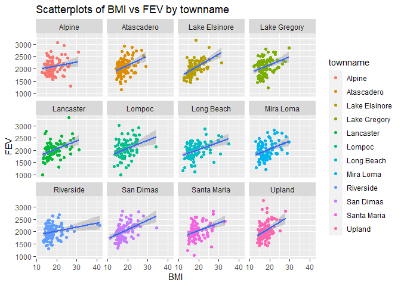
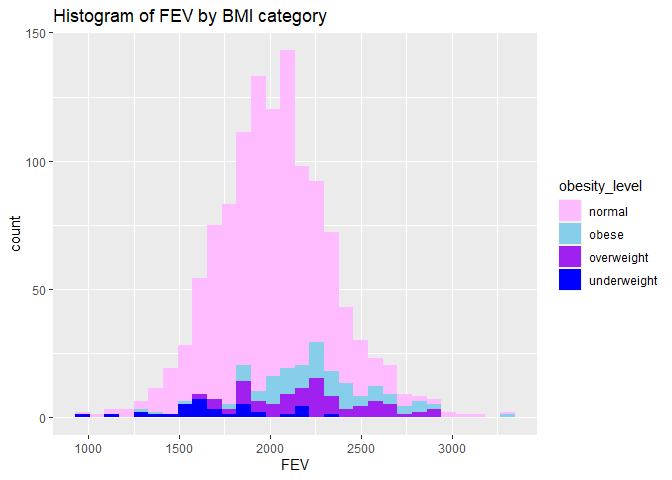
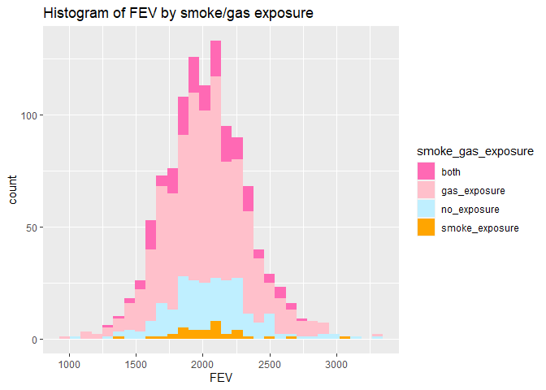
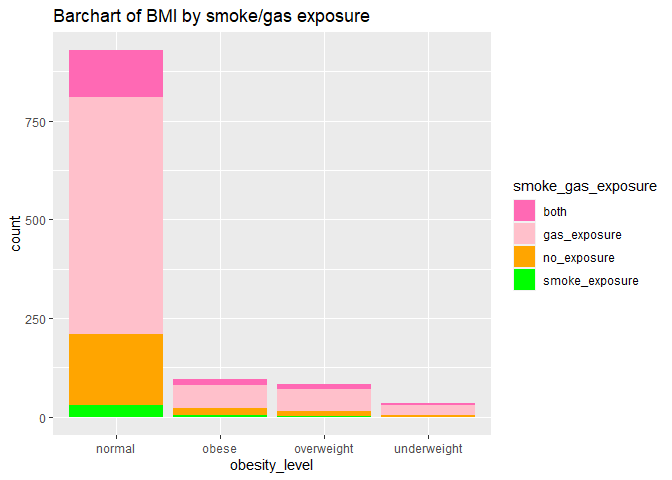
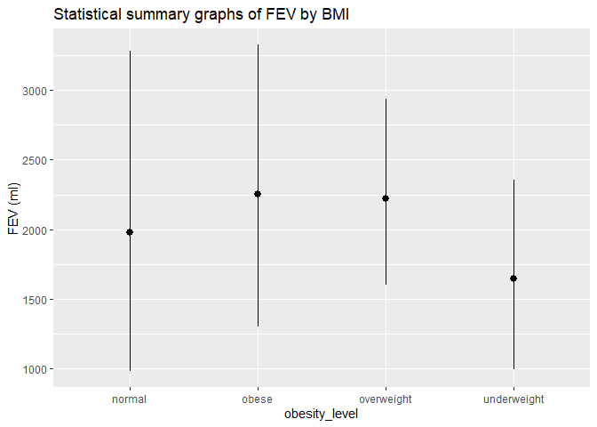
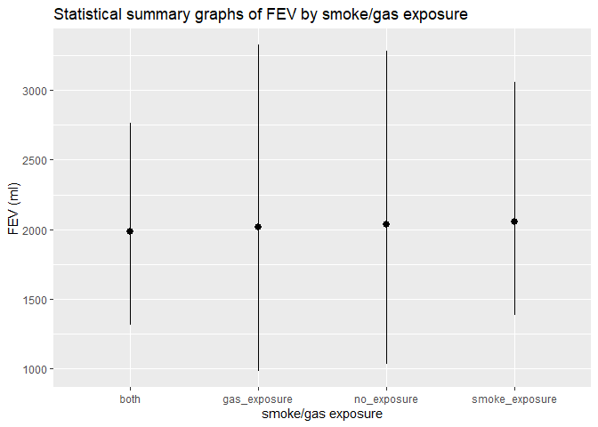
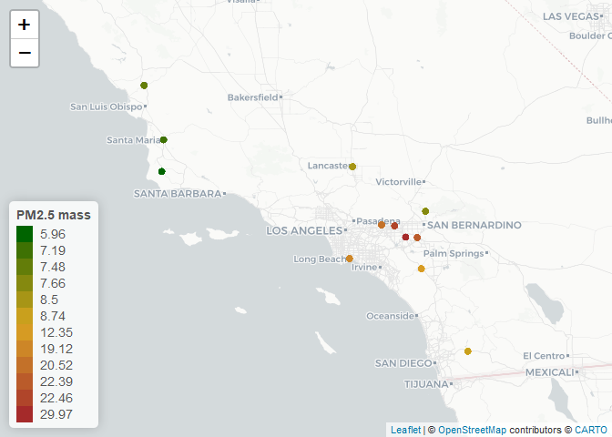
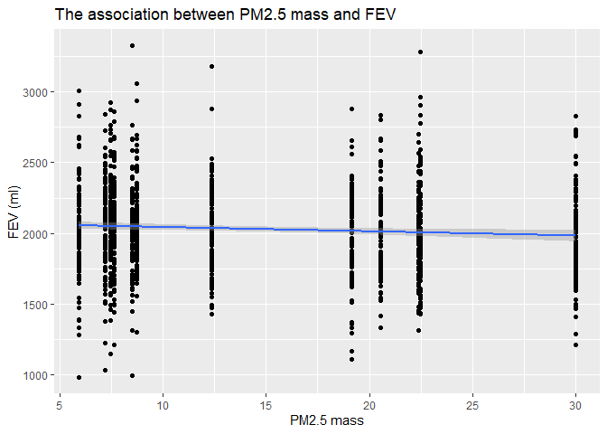

Assignment02
================
Yuwei Wu
2022-10-06

# Data Wrangling

## Read in data.

``` r
ind <- data.table::fread("chs_individual.csv")
reg <- data.table::fread("chs_regional.csv")
```

## Merge these datasets using the location variable.

``` r
chs <- merge(
  x     = ind,      
  y     = reg, 
  by  = "townname",
  all.x = TRUE,      
  all.y = FALSE
  )
```

## 1.After merging the data, make sure you don’t have any duplicates by counting the number of rows. Make sure it matches. In the case of missing values, impute data using the average within the variables “male” and “hispanic.”

``` r
nrow(ind)
```

    ## [1] 1200

``` r
nrow(reg)
```

    ## [1] 12

``` r
nrow(chs)
```

    ## [1] 1200

There are no duplicates after the merge.

## Check missing values.

``` r
summary(is.na(chs))
```

    ##   townname          sid             male            race        
    ##  Mode :logical   Mode :logical   Mode :logical   Mode :logical  
    ##  FALSE:1200      FALSE:1200      FALSE:1200      FALSE:1200     
    ##                                                                 
    ##   hispanic         agepft          height          weight       
    ##  Mode :logical   Mode :logical   Mode :logical   Mode :logical  
    ##  FALSE:1200      FALSE:1111      FALSE:1111      FALSE:1111     
    ##                  TRUE :89        TRUE :89        TRUE :89       
    ##     bmi            asthma        active_asthma   father_asthma  
    ##  Mode :logical   Mode :logical   Mode :logical   Mode :logical  
    ##  FALSE:1111      FALSE:1169      FALSE:1200      FALSE:1094     
    ##  TRUE :89        TRUE :31                        TRUE :106      
    ##  mother_asthma     wheeze         hayfever        allergy       
    ##  Mode :logical   Mode :logical   Mode :logical   Mode :logical  
    ##  FALSE:1144      FALSE:1129      FALSE:1082      FALSE:1137     
    ##  TRUE :56        TRUE :71        TRUE :118       TRUE :63       
    ##  educ_parent       smoke            pets          gasstove      
    ##  Mode :logical   Mode :logical   Mode :logical   Mode :logical  
    ##  FALSE:1136      FALSE:1160      FALSE:1200      FALSE:1167     
    ##  TRUE :64        TRUE :40                        TRUE :33       
    ##     fev             fvc             mmef         pm25_mass      
    ##  Mode :logical   Mode :logical   Mode :logical   Mode :logical  
    ##  FALSE:1105      FALSE:1103      FALSE:1094      FALSE:1200     
    ##  TRUE :95        TRUE :97        TRUE :106                      
    ##   pm25_so4        pm25_no3        pm25_nh4        pm25_oc       
    ##  Mode :logical   Mode :logical   Mode :logical   Mode :logical  
    ##  FALSE:1200      FALSE:1200      FALSE:1200      FALSE:1200     
    ##                                                                 
    ##   pm25_ec         pm25_om         pm10_oc         pm10_ec       
    ##  Mode :logical   Mode :logical   Mode :logical   Mode :logical  
    ##  FALSE:1200      FALSE:1200      FALSE:1200      FALSE:1200     
    ##                                                                 
    ##   pm10_tc          formic          acetic           hcl         
    ##  Mode :logical   Mode :logical   Mode :logical   Mode :logical  
    ##  FALSE:1200      FALSE:1200      FALSE:1200      FALSE:1200     
    ##                                                                 
    ##     hno3           o3_max          o3106           o3_24        
    ##  Mode :logical   Mode :logical   Mode :logical   Mode :logical  
    ##  FALSE:1200      FALSE:1200      FALSE:1200      FALSE:1200     
    ##                                                                 
    ##     no2             pm10          no_24hr         pm2_5_fr      
    ##  Mode :logical   Mode :logical   Mode :logical   Mode :logical  
    ##  FALSE:1200      FALSE:1200      FALSE:1100      FALSE:900      
    ##                                  TRUE :100       TRUE :300      
    ##    iacid           oacid         total_acids        lon         
    ##  Mode :logical   Mode :logical   Mode :logical   Mode :logical  
    ##  FALSE:1200      FALSE:1200      FALSE:1200      FALSE:1200     
    ##                                                                 
    ##     lat         
    ##  Mode :logical  
    ##  FALSE:1200     
    ## 

There are missing values for agepft, height, weight, bmi, asthma,
father_asthma, mother_asthma, wheeze, hayfever, allergy, educ_parent,
smoke, gasstove, fev, fvc, mmef, no_24hr, pm2_5\_fr.

Then I imputed all missing values in numeric variables.

``` r
chs[, agepft_imp:= fcoalesce(agepft, mean(agepft, na.rm = TRUE)),
    by = .(male, hispanic)]
chs[, height_imp:= fcoalesce(as.double(height), mean(height, na.rm = TRUE)),
    by = .(male, hispanic)]
chs[, weight_imp:= fcoalesce(as.double(weight), mean(weight, na.rm = TRUE)),
    by = .(male, hispanic)]
chs[, bmi_imp:= fcoalesce(bmi, mean(bmi, na.rm = TRUE)),
    by = .(male, hispanic)]
chs[, fev_imp:= fcoalesce(fev, mean(fev, na.rm = TRUE)),
    by = .(male, hispanic)]
chs[, fvc_imp:= fcoalesce(fvc, mean(fvc, na.rm = TRUE)),
    by = .(male, hispanic)]
chs[, mmef_imp:= fcoalesce(mmef, mean(mmef, na.rm = TRUE)),
    by = .(male, hispanic)]
chs[, no_24hr_imp:= fcoalesce(no_24hr, mean(no_24hr, na.rm = TRUE)),
    by = .(male, hispanic)]
chs[, pm2_5_fr_imp:= fcoalesce(pm2_5_fr, mean(pm2_5_fr, na.rm = TRUE)),
    by = .(male, hispanic)]
```

``` r
summary(is.na(chs))
```

    ##   townname          sid             male            race        
    ##  Mode :logical   Mode :logical   Mode :logical   Mode :logical  
    ##  FALSE:1200      FALSE:1200      FALSE:1200      FALSE:1200     
    ##                                                                 
    ##   hispanic         agepft          height          weight       
    ##  Mode :logical   Mode :logical   Mode :logical   Mode :logical  
    ##  FALSE:1200      FALSE:1111      FALSE:1111      FALSE:1111     
    ##                  TRUE :89        TRUE :89        TRUE :89       
    ##     bmi            asthma        active_asthma   father_asthma  
    ##  Mode :logical   Mode :logical   Mode :logical   Mode :logical  
    ##  FALSE:1111      FALSE:1169      FALSE:1200      FALSE:1094     
    ##  TRUE :89        TRUE :31                        TRUE :106      
    ##  mother_asthma     wheeze         hayfever        allergy       
    ##  Mode :logical   Mode :logical   Mode :logical   Mode :logical  
    ##  FALSE:1144      FALSE:1129      FALSE:1082      FALSE:1137     
    ##  TRUE :56        TRUE :71        TRUE :118       TRUE :63       
    ##  educ_parent       smoke            pets          gasstove      
    ##  Mode :logical   Mode :logical   Mode :logical   Mode :logical  
    ##  FALSE:1136      FALSE:1160      FALSE:1200      FALSE:1167     
    ##  TRUE :64        TRUE :40                        TRUE :33       
    ##     fev             fvc             mmef         pm25_mass      
    ##  Mode :logical   Mode :logical   Mode :logical   Mode :logical  
    ##  FALSE:1105      FALSE:1103      FALSE:1094      FALSE:1200     
    ##  TRUE :95        TRUE :97        TRUE :106                      
    ##   pm25_so4        pm25_no3        pm25_nh4        pm25_oc       
    ##  Mode :logical   Mode :logical   Mode :logical   Mode :logical  
    ##  FALSE:1200      FALSE:1200      FALSE:1200      FALSE:1200     
    ##                                                                 
    ##   pm25_ec         pm25_om         pm10_oc         pm10_ec       
    ##  Mode :logical   Mode :logical   Mode :logical   Mode :logical  
    ##  FALSE:1200      FALSE:1200      FALSE:1200      FALSE:1200     
    ##                                                                 
    ##   pm10_tc          formic          acetic           hcl         
    ##  Mode :logical   Mode :logical   Mode :logical   Mode :logical  
    ##  FALSE:1200      FALSE:1200      FALSE:1200      FALSE:1200     
    ##                                                                 
    ##     hno3           o3_max          o3106           o3_24        
    ##  Mode :logical   Mode :logical   Mode :logical   Mode :logical  
    ##  FALSE:1200      FALSE:1200      FALSE:1200      FALSE:1200     
    ##                                                                 
    ##     no2             pm10          no_24hr         pm2_5_fr      
    ##  Mode :logical   Mode :logical   Mode :logical   Mode :logical  
    ##  FALSE:1200      FALSE:1200      FALSE:1100      FALSE:900      
    ##                                  TRUE :100       TRUE :300      
    ##    iacid           oacid         total_acids        lon         
    ##  Mode :logical   Mode :logical   Mode :logical   Mode :logical  
    ##  FALSE:1200      FALSE:1200      FALSE:1200      FALSE:1200     
    ##                                                                 
    ##     lat          agepft_imp      height_imp      weight_imp     
    ##  Mode :logical   Mode :logical   Mode :logical   Mode :logical  
    ##  FALSE:1200      FALSE:1200      FALSE:1200      FALSE:1200     
    ##                                                                 
    ##   bmi_imp         fev_imp         fvc_imp         mmef_imp      
    ##  Mode :logical   Mode :logical   Mode :logical   Mode :logical  
    ##  FALSE:1200      FALSE:1200      FALSE:1200      FALSE:1200     
    ##                                                                 
    ##  no_24hr_imp     pm2_5_fr_imp   
    ##  Mode :logical   Mode :logical  
    ##  FALSE:1200      FALSE:1200     
    ## 

Now there are no missing values in these variables.

# 2.Create a new categorical variable named “obesity_level” using the BMI measurement (underweight BMI\<14; normal BMI 14-22; overweight BMI 22-24; obese BMI\>24). To make sure the variable is rightly coded, create a summary table that contains the minimum BMI, maximum BMI, and the total number of observations per category.

``` r
chs <- chs[, obesity_level := fifelse(
    bmi_imp < 14, "underweight", 
    fifelse(bmi_imp<22, "normal",
    fifelse(bmi_imp<=24, "overweight", "obese")))]
```

Create a summary table

``` r
tab <- chs[, .(
  min_bmi = min(bmi_imp),
  max_bmi = max(bmi_imp),
  N_obs = .N
), by = obesity_level]

knitr::kable(tab)
```

| obesity_level |  min_bmi |  max_bmi | N_obs |
|:--------------|---------:|---------:|------:|
| normal        | 14.00380 | 21.96387 |   975 |
| overweight    | 22.02353 | 23.99650 |    87 |
| obese         | 24.00647 | 41.26613 |   103 |
| underweight   | 11.29640 | 13.98601 |    35 |

# 3.Create another categorical variable named “smoke_gas_exposure” that summarizes “Second Hand Smoke” and “Gas Stove.” The variable should have four categories in total.

``` r
chs <- chs[, smoke_gas_exposure := fifelse(
    smoke == 0 & gasstove == 0, "no_exposure",
    fifelse(smoke == 1 & gasstove == 0, "smoke_exposure",
    fifelse(smoke == 0 & gasstove == 1, "gas_exposure","both")))]
table(chs$smoke_gas_exposure, useNA = "always")
```

    ## 
    ##           both   gas_exposure    no_exposure smoke_exposure           <NA> 
    ##            151            739            214             36             60

Now there are four categories. 214 people who are not exposed to second
hand smoke and gas stove. 36 people who are only exposed to second hand
smoke. 739 people who are only exposed to gas stove. 151 people who are
both exposed to second hand smoke and gas stove. And there are 60
missing values.

# 4.Create four summary tables showing the average (or proportion, if binary) and sd of “Forced expiratory volume in 1 second (ml)” and asthma indicator by town, sex, obesity level, and “smoke_gas_exposure.”

by town:

``` r
town <- chs[, .(
  avg_fev    = mean(fev_imp, na.rm = TRUE),
  sd_fev    = sd(fev_imp, na.rm = TRUE),
  prop_asthma = sum(asthma==1, na.rm = TRUE)/sum(asthma==1 | asthma==0, na.rm = TRUE),
  N_obs = .N
), by = townname]

knitr::kable(town)
```

| townname      |  avg_fev |   sd_fev | prop_asthma | N_obs |
|:--------------|---------:|---------:|------------:|------:|
| Alpine        | 2087.101 | 291.1768 |   0.1134021 |   100 |
| Atascadero    | 2075.897 | 324.0935 |   0.2551020 |   100 |
| Lake Elsinore | 2038.849 | 303.6956 |   0.1263158 |   100 |
| Lake Gregory  | 2084.700 | 319.9593 |   0.1515152 |   100 |
| Lancaster     | 2003.044 | 317.1298 |   0.1649485 |   100 |
| Lompoc        | 2034.354 | 351.0454 |   0.1134021 |   100 |
| Long Beach    | 1985.861 | 319.4625 |   0.1354167 |   100 |
| Mira Loma     | 1985.202 | 324.9634 |   0.1578947 |   100 |
| Riverside     | 1989.881 | 277.5065 |   0.1100000 |   100 |
| San Dimas     | 2026.794 | 318.7845 |   0.1717172 |   100 |
| Santa Maria   | 2025.750 | 312.1725 |   0.1340206 |   100 |
| Upland        | 2024.266 | 343.1637 |   0.1212121 |   100 |

By town, the mean of “Forced expiratory volume in 1 second (ml)” is very
close in 12 towns. People who live in Alpine have the highest mean which
is 2087.101 ml, and people who live in Mira Loma have the lowest mean
which is 1985.202 ml. Also, the proportion of asthma is very close in
these towns except for people who live in Atascadero have the highest
proportion of asthma which is 25.51%.

by sex:

``` r
sex <- chs[, .(
  avg_fev    = mean(fev_imp, na.rm = TRUE),
  sd_fev    = sd(fev_imp, na.rm = TRUE),
  prop_asthma = sum(asthma==1, na.rm = TRUE)/sum(asthma==1 | asthma==0, na.rm = TRUE),
  N_obs = .N
), by = male]

knitr::kable(sex)
```

| male |  avg_fev |   sd_fev | prop_asthma | N_obs |
|-----:|---------:|---------:|------------:|------:|
|    0 | 1958.911 | 311.9181 |   0.1208054 |   610 |
|    1 | 2103.787 | 307.5123 |   0.1727749 |   590 |

By sex, the mean of “Forced expiratory volume in 1 second (ml)” and the
proportion of asthma is very similar in males and females.

by obesity:

``` r
obesity <- chs[, .(
  avg_fev    = mean(fev_imp, na.rm = TRUE),
  sd_fev    = sd(fev_imp, na.rm = TRUE),
  prop_asthma = sum(asthma==1, na.rm = TRUE)/sum(asthma==1 | asthma==0, na.rm = TRUE),
  N_obs = .N
), by = obesity_level]

knitr::kable(obesity)
```

| obesity_level |  avg_fev |   sd_fev | prop_asthma | N_obs |
|:--------------|---------:|---------:|------------:|------:|
| normal        | 1999.794 | 295.1964 |   0.1401475 |   975 |
| overweight    | 2224.322 | 317.4261 |   0.1647059 |    87 |
| obese         | 2266.154 | 325.4710 |   0.2100000 |   103 |
| underweight   | 1698.327 | 303.3983 |   0.0857143 |    35 |

By obesity level, people who are obese have the highest mean of “Forced
expiratory volume in 1 second (ml)” which is 2266.154 ml, and people who
are underweight have the lowest mean of “Forced expiratory volume in 1
second (ml)” which is 1698.327 ml. Also, people who are obese have the
highest proportion of asthma which is 21%, and people who are
underweight have the lowest proportion of asthma which is 8.57%.

by “smoke_gas_exposure”:

``` r
smoke_gas_exposure <- chs[, .(
  avg_fev    = mean(fev_imp, na.rm = TRUE),
  sd_fev    = sd(fev_imp, na.rm = TRUE),
  prop_asthma = sum(asthma==1, na.rm = TRUE)/sum(asthma==1 | asthma==0, na.rm = TRUE),
  N_obs = .N
), by = smoke_gas_exposure]

knitr::kable(smoke_gas_exposure)
```

| smoke_gas_exposure |  avg_fev |   sd_fev | prop_asthma | N_obs |
|:-------------------|---------:|---------:|------------:|------:|
| no_exposure        | 2055.356 | 330.4169 |   0.1476190 |   214 |
| NA                 | 2001.878 | 340.2592 |   0.1489362 |    60 |
| smoke_exposure     | 2055.714 | 295.6475 |   0.1714286 |    36 |
| gas_exposure       | 2025.989 | 317.6305 |   0.1477428 |   739 |
| both               | 2019.867 | 298.9728 |   0.1301370 |   151 |

By “Second Hand Smoke” and “Gas Stove” exposure, the mean of “Forced
expiratory volume in 1 second (ml)” and the proportion of asthma are
very similar in these groups.

# Looking at the Data (EDA)

The primary questions of interest are: 1. What is the association
between BMI and FEV (forced expiratory volume)? 2. What is the
association between smoke and gas exposure and FEV? 3. What is the
association between PM2.5 exposure and FEV?

## First, check the dimensions, headers, footers.

``` r
dim(chs)
```

    ## [1] 1200   60

There are 1200 rows and 60 columns.

``` r
head(chs)
```

    ##    townname sid male race hispanic    agepft height weight      bmi asthma
    ## 1:   Alpine 835    0    W        0 10.099932    143     69 15.33749      0
    ## 2:   Alpine 838    0    O        1  9.486653    133     62 15.93183      0
    ## 3:   Alpine 839    0    M        1 10.053388    142     86 19.38649      0
    ## 4:   Alpine 840    0    W        0  9.965777    146     78 16.63283      0
    ## 5:   Alpine 841    1    W        1 10.548939    150     78 15.75758      0
    ## 6:   Alpine 842    1    M        1  9.489391    139     65 15.29189      0
    ##    active_asthma father_asthma mother_asthma wheeze hayfever allergy
    ## 1:             0             0             0      0        0       1
    ## 2:             0             0             0      0        0       0
    ## 3:             0             0             1      1        1       1
    ## 4:             0             0             0      0        0       0
    ## 5:             0             0             0      0        0       0
    ## 6:             0             0             0      1        0       0
    ##    educ_parent smoke pets gasstove      fev      fvc     mmef pm25_mass
    ## 1:           3     0    1        0 2529.276 2826.316 3406.579      8.74
    ## 2:           4    NA    1        0 1737.793 1963.545 2133.110      8.74
    ## 3:           3     1    1        0 2121.711 2326.974 2835.197      8.74
    ## 4:          NA    NA    0       NA 2466.791 2638.221 3466.464      8.74
    ## 5:           5     0    1        0 2251.505 2594.649 2445.151      8.74
    ## 6:           1     1    1        0 2188.716 2423.934 2524.599      8.74
    ##    pm25_so4 pm25_no3 pm25_nh4 pm25_oc pm25_ec pm25_om pm10_oc pm10_ec pm10_tc
    ## 1:     1.73     1.59     0.88    2.54    0.48    3.04    3.25    0.49    3.75
    ## 2:     1.73     1.59     0.88    2.54    0.48    3.04    3.25    0.49    3.75
    ## 3:     1.73     1.59     0.88    2.54    0.48    3.04    3.25    0.49    3.75
    ## 4:     1.73     1.59     0.88    2.54    0.48    3.04    3.25    0.49    3.75
    ## 5:     1.73     1.59     0.88    2.54    0.48    3.04    3.25    0.49    3.75
    ## 6:     1.73     1.59     0.88    2.54    0.48    3.04    3.25    0.49    3.75
    ##    formic acetic  hcl hno3 o3_max o3106 o3_24   no2  pm10 no_24hr pm2_5_fr
    ## 1:   1.03   2.49 0.41 1.98  65.82 55.05 41.23 12.18 24.73    2.48    10.28
    ## 2:   1.03   2.49 0.41 1.98  65.82 55.05 41.23 12.18 24.73    2.48    10.28
    ## 3:   1.03   2.49 0.41 1.98  65.82 55.05 41.23 12.18 24.73    2.48    10.28
    ## 4:   1.03   2.49 0.41 1.98  65.82 55.05 41.23 12.18 24.73    2.48    10.28
    ## 5:   1.03   2.49 0.41 1.98  65.82 55.05 41.23 12.18 24.73    2.48    10.28
    ## 6:   1.03   2.49 0.41 1.98  65.82 55.05 41.23 12.18 24.73    2.48    10.28
    ##    iacid oacid total_acids       lon      lat agepft_imp height_imp weight_imp
    ## 1:  2.39  3.52         5.5 -116.7664 32.83505  10.099932        143         69
    ## 2:  2.39  3.52         5.5 -116.7664 32.83505   9.486653        133         62
    ## 3:  2.39  3.52         5.5 -116.7664 32.83505  10.053388        142         86
    ## 4:  2.39  3.52         5.5 -116.7664 32.83505   9.965777        146         78
    ## 5:  2.39  3.52         5.5 -116.7664 32.83505  10.548939        150         78
    ## 6:  2.39  3.52         5.5 -116.7664 32.83505   9.489391        139         65
    ##     bmi_imp  fev_imp  fvc_imp mmef_imp no_24hr_imp pm2_5_fr_imp obesity_level
    ## 1: 15.33749 2529.276 2826.316 3406.579        2.48        10.28        normal
    ## 2: 15.93183 1737.793 1963.545 2133.110        2.48        10.28        normal
    ## 3: 19.38649 2121.711 2326.974 2835.197        2.48        10.28        normal
    ## 4: 16.63283 2466.791 2638.221 3466.464        2.48        10.28        normal
    ## 5: 15.75758 2251.505 2594.649 2445.151        2.48        10.28        normal
    ## 6: 15.29189 2188.716 2423.934 2524.599        2.48        10.28        normal
    ##    smoke_gas_exposure
    ## 1:        no_exposure
    ## 2:               <NA>
    ## 3:     smoke_exposure
    ## 4:               <NA>
    ## 5:        no_exposure
    ## 6:     smoke_exposure

``` r
tail(chs)
```

    ##    townname  sid male race hispanic    agepft height weight      bmi asthma
    ## 1:   Upland 1866    0    O        1  9.806982    139     60 14.11559      0
    ## 2:   Upland 1867    0    M        1  9.618070    140     71 16.46568      0
    ## 3:   Upland 2031    1    W        0  9.798768    135     83 20.70084      0
    ## 4:   Upland 2032    1    W        0  9.549624    137     59 14.28855      0
    ## 5:   Upland 2033    0    M        0 10.121834    130     67 18.02044      0
    ## 6:   Upland 2053    0    W        0        NA     NA     NA       NA      0
    ##    active_asthma father_asthma mother_asthma wheeze hayfever allergy
    ## 1:             0            NA             0      0       NA      NA
    ## 2:             0             1             0      0        0       0
    ## 3:             0             0             0      1        0       1
    ## 4:             0             0             1      1        1       1
    ## 5:             1             0             0      1        1       0
    ## 6:             0             0             0      0        0       0
    ##    educ_parent smoke pets gasstove      fev      fvc     mmef pm25_mass
    ## 1:           3     0    1        0 1691.275 1928.859 1890.604     22.46
    ## 2:           3     0    1        0 1733.338 1993.040 2072.643     22.46
    ## 3:           3     0    1        1 2034.177 2505.535 1814.075     22.46
    ## 4:           3     0    1        1 2077.703 2275.338 2706.081     22.46
    ## 5:           3     0    1        1 1929.866 2122.148 2558.054     22.46
    ## 6:           3     0    1        0       NA       NA       NA     22.46
    ##    pm25_so4 pm25_no3 pm25_nh4 pm25_oc pm25_ec pm25_om pm10_oc pm10_ec pm10_tc
    ## 1:     2.65     7.75     2.96    6.49    1.19    7.79    8.32    1.22    9.54
    ## 2:     2.65     7.75     2.96    6.49    1.19    7.79    8.32    1.22    9.54
    ## 3:     2.65     7.75     2.96    6.49    1.19    7.79    8.32    1.22    9.54
    ## 4:     2.65     7.75     2.96    6.49    1.19    7.79    8.32    1.22    9.54
    ## 5:     2.65     7.75     2.96    6.49    1.19    7.79    8.32    1.22    9.54
    ## 6:     2.65     7.75     2.96    6.49    1.19    7.79    8.32    1.22    9.54
    ##    formic acetic  hcl hno3 o3_max o3106 o3_24   no2 pm10 no_24hr pm2_5_fr iacid
    ## 1:   2.67   4.73 0.46 4.03  63.83  46.5  22.2 37.97 40.8   18.48    27.73  4.49
    ## 2:   2.67   4.73 0.46 4.03  63.83  46.5  22.2 37.97 40.8   18.48    27.73  4.49
    ## 3:   2.67   4.73 0.46 4.03  63.83  46.5  22.2 37.97 40.8   18.48    27.73  4.49
    ## 4:   2.67   4.73 0.46 4.03  63.83  46.5  22.2 37.97 40.8   18.48    27.73  4.49
    ## 5:   2.67   4.73 0.46 4.03  63.83  46.5  22.2 37.97 40.8   18.48    27.73  4.49
    ## 6:   2.67   4.73 0.46 4.03  63.83  46.5  22.2 37.97 40.8   18.48    27.73  4.49
    ##    oacid total_acids       lon      lat agepft_imp height_imp weight_imp
    ## 1:   7.4       11.43 -117.6484 34.09751   9.806982    139.000   60.00000
    ## 2:   7.4       11.43 -117.6484 34.09751   9.618070    140.000   71.00000
    ## 3:   7.4       11.43 -117.6484 34.09751   9.798768    135.000   83.00000
    ## 4:   7.4       11.43 -117.6484 34.09751   9.549624    137.000   59.00000
    ## 5:   7.4       11.43 -117.6484 34.09751  10.121834    130.000   67.00000
    ## 6:   7.4       11.43 -117.6484 34.09751   9.849789    138.972   77.39564
    ##     bmi_imp  fev_imp  fvc_imp mmef_imp no_24hr_imp pm2_5_fr_imp obesity_level
    ## 1: 14.11559 1691.275 1928.859 1890.604       18.48        27.73        normal
    ## 2: 16.46568 1733.338 1993.040 2072.643       18.48        27.73        normal
    ## 3: 20.70084 2034.177 2505.535 1814.075       18.48        27.73        normal
    ## 4: 14.28855 2077.703 2275.338 2706.081       18.48        27.73        normal
    ## 5: 18.02044 1929.866 2122.148 2558.054       18.48        27.73        normal
    ## 6: 18.05281 1945.743 2198.915 2365.589       18.48        27.73        normal
    ##    smoke_gas_exposure
    ## 1:        no_exposure
    ## 2:        no_exposure
    ## 3:       gas_exposure
    ## 4:       gas_exposure
    ## 5:       gas_exposure
    ## 6:        no_exposure

## Take a look at the variables.

``` r
str(chs)
```

    ## Classes 'data.table' and 'data.frame':   1200 obs. of  60 variables:
    ##  $ townname          : chr  "Alpine" "Alpine" "Alpine" "Alpine" ...
    ##  $ sid               : int  835 838 839 840 841 842 843 844 847 849 ...
    ##  $ male              : int  0 0 0 0 1 1 1 1 1 1 ...
    ##  $ race              : chr  "W" "O" "M" "W" ...
    ##  $ hispanic          : int  0 1 1 0 1 1 0 1 0 0 ...
    ##  $ agepft            : num  10.1 9.49 10.05 9.97 10.55 ...
    ##  $ height            : int  143 133 142 146 150 139 149 143 137 147 ...
    ##  $ weight            : int  69 62 86 78 78 65 98 65 69 112 ...
    ##  $ bmi               : num  15.3 15.9 19.4 16.6 15.8 ...
    ##  $ asthma            : int  0 0 0 0 0 0 0 NA 0 0 ...
    ##  $ active_asthma     : int  0 0 0 0 0 0 0 0 0 0 ...
    ##  $ father_asthma     : int  0 0 0 0 0 0 0 NA 0 1 ...
    ##  $ mother_asthma     : int  0 0 1 0 0 0 0 NA 0 0 ...
    ##  $ wheeze            : int  0 0 1 0 0 1 1 NA 0 1 ...
    ##  $ hayfever          : int  0 0 1 0 0 0 0 NA 0 0 ...
    ##  $ allergy           : int  1 0 1 0 0 0 1 NA 0 1 ...
    ##  $ educ_parent       : int  3 4 3 NA 5 1 3 NA 5 3 ...
    ##  $ smoke             : int  0 NA 1 NA 0 1 0 NA 0 0 ...
    ##  $ pets              : int  1 1 1 0 1 1 1 0 1 1 ...
    ##  $ gasstove          : int  0 0 0 NA 0 0 1 NA 1 0 ...
    ##  $ fev               : num  2529 1738 2122 2467 2252 ...
    ##  $ fvc               : num  2826 1964 2327 2638 2595 ...
    ##  $ mmef              : num  3407 2133 2835 3466 2445 ...
    ##  $ pm25_mass         : num  8.74 8.74 8.74 8.74 8.74 8.74 8.74 8.74 8.74 8.74 ...
    ##  $ pm25_so4          : num  1.73 1.73 1.73 1.73 1.73 1.73 1.73 1.73 1.73 1.73 ...
    ##  $ pm25_no3          : num  1.59 1.59 1.59 1.59 1.59 1.59 1.59 1.59 1.59 1.59 ...
    ##  $ pm25_nh4          : num  0.88 0.88 0.88 0.88 0.88 0.88 0.88 0.88 0.88 0.88 ...
    ##  $ pm25_oc           : num  2.54 2.54 2.54 2.54 2.54 2.54 2.54 2.54 2.54 2.54 ...
    ##  $ pm25_ec           : num  0.48 0.48 0.48 0.48 0.48 0.48 0.48 0.48 0.48 0.48 ...
    ##  $ pm25_om           : num  3.04 3.04 3.04 3.04 3.04 3.04 3.04 3.04 3.04 3.04 ...
    ##  $ pm10_oc           : num  3.25 3.25 3.25 3.25 3.25 3.25 3.25 3.25 3.25 3.25 ...
    ##  $ pm10_ec           : num  0.49 0.49 0.49 0.49 0.49 0.49 0.49 0.49 0.49 0.49 ...
    ##  $ pm10_tc           : num  3.75 3.75 3.75 3.75 3.75 3.75 3.75 3.75 3.75 3.75 ...
    ##  $ formic            : num  1.03 1.03 1.03 1.03 1.03 1.03 1.03 1.03 1.03 1.03 ...
    ##  $ acetic            : num  2.49 2.49 2.49 2.49 2.49 2.49 2.49 2.49 2.49 2.49 ...
    ##  $ hcl               : num  0.41 0.41 0.41 0.41 0.41 0.41 0.41 0.41 0.41 0.41 ...
    ##  $ hno3              : num  1.98 1.98 1.98 1.98 1.98 1.98 1.98 1.98 1.98 1.98 ...
    ##  $ o3_max            : num  65.8 65.8 65.8 65.8 65.8 ...
    ##  $ o3106             : num  55 55 55 55 55 ...
    ##  $ o3_24             : num  41.2 41.2 41.2 41.2 41.2 ...
    ##  $ no2               : num  12.2 12.2 12.2 12.2 12.2 ...
    ##  $ pm10              : num  24.7 24.7 24.7 24.7 24.7 ...
    ##  $ no_24hr           : num  2.48 2.48 2.48 2.48 2.48 2.48 2.48 2.48 2.48 2.48 ...
    ##  $ pm2_5_fr          : num  10.3 10.3 10.3 10.3 10.3 ...
    ##  $ iacid             : num  2.39 2.39 2.39 2.39 2.39 2.39 2.39 2.39 2.39 2.39 ...
    ##  $ oacid             : num  3.52 3.52 3.52 3.52 3.52 3.52 3.52 3.52 3.52 3.52 ...
    ##  $ total_acids       : num  5.5 5.5 5.5 5.5 5.5 5.5 5.5 5.5 5.5 5.5 ...
    ##  $ lon               : num  -117 -117 -117 -117 -117 ...
    ##  $ lat               : num  32.8 32.8 32.8 32.8 32.8 ...
    ##  $ agepft_imp        : num  10.1 9.49 10.05 9.97 10.55 ...
    ##  $ height_imp        : num  143 133 142 146 150 139 149 143 137 147 ...
    ##  $ weight_imp        : num  69 62 86 78 78 65 98 65 69 112 ...
    ##  $ bmi_imp           : num  15.3 15.9 19.4 16.6 15.8 ...
    ##  $ fev_imp           : num  2529 1738 2122 2467 2252 ...
    ##  $ fvc_imp           : num  2826 1964 2327 2638 2595 ...
    ##  $ mmef_imp          : num  3407 2133 2835 3466 2445 ...
    ##  $ no_24hr_imp       : num  2.48 2.48 2.48 2.48 2.48 2.48 2.48 2.48 2.48 2.48 ...
    ##  $ pm2_5_fr_imp      : num  10.3 10.3 10.3 10.3 10.3 ...
    ##  $ obesity_level     : chr  "normal" "normal" "normal" "normal" ...
    ##  $ smoke_gas_exposure: chr  "no_exposure" NA "smoke_exposure" NA ...
    ##  - attr(*, ".internal.selfref")=<externalptr> 
    ##  - attr(*, "sorted")= chr "townname"

## Take a closer look at the key variables.

``` r
table(chs$townname)
```

    ## 
    ##        Alpine    Atascadero Lake Elsinore  Lake Gregory     Lancaster 
    ##           100           100           100           100           100 
    ##        Lompoc    Long Beach     Mira Loma     Riverside     San Dimas 
    ##           100           100           100           100           100 
    ##   Santa Maria        Upland 
    ##           100           100

``` r
table(chs$obesity_level)
```

    ## 
    ##      normal       obese  overweight underweight 
    ##         975         103          87          35

``` r
table(chs$smoke_gas_exposure)
```

    ## 
    ##           both   gas_exposure    no_exposure smoke_exposure 
    ##            151            739            214             36

``` r
summary(chs$bmi_imp)
```

    ##    Min. 1st Qu.  Median    Mean 3rd Qu.    Max. 
    ##   11.30   15.96   17.81   18.50   19.99   41.27

``` r
summary(chs$fev_imp)
```

    ##    Min. 1st Qu.  Median    Mean 3rd Qu.    Max. 
    ##   984.8  1827.6  2016.4  2030.1  2223.6  3323.7

``` r
summary(chs$pm25_mass)
```

    ##    Min. 1st Qu.  Median    Mean 3rd Qu.    Max. 
    ##   5.960   7.615  10.545  14.362  20.988  29.970

# 1.Facet plot showing scatterplots with regression lines of BMI vs FEV by “townname”.

``` r
chs[!is.na(bmi_imp) & !is.na(fev_imp)] %>% 
  ggplot(mapping = aes(x = bmi_imp, y = fev_imp)) + 
  geom_point(mapping = aes(color = townname)) + 
  geom_smooth(method = lm,formula = y~x)+
  facet_wrap(~ townname)+
  labs(title = "Scatterplots of BMI vs FEV by townname", x = "BMI", y = "FEV")
```

<!-- -->

From the scatterplots, we can see that BMI has a positive association
with FEV in 12 towns. FEV increased with the increase of BMI in 12
towns.

# 2.Stacked histograms of FEV by BMI category and FEV by smoke/gas exposure. Use different color schemes than the ggplot default.

by BMI category:

``` r
chs[!is.na(fev_imp)] %>% 
  ggplot(mapping = aes(x = fev_imp), fill = obesity_level) + 
  geom_histogram(aes(fill = obesity_level), bins = 30) + 
  scale_fill_manual(values = c("plum 1","sky blue","purple","blue"))+
  labs(title = "Histogram of FEV by BMI category", x = "FEV")
```

<!-- -->

From the histogram, we can see that the largest number of people is in
the “normal” obesity level, it is normally distributed. The distribution
of people who are in the “obese” or “overweight” obesity level looks
left skewed. The smallest number of people is in the “underweight”
obesity level, it looks like not normally distributed.

by smoke/gas exposure:

``` r
chs[!is.na(fev_imp)& !is.na(smoke_gas_exposure)] %>% 
  ggplot(mapping = aes(x = fev_imp), fill = smoke_gas_exposure) + 
  geom_histogram(aes(fill = smoke_gas_exposure), bins = 30) + 
  scale_fill_manual(values = c("hotpink","pink","light blue1","orange"))+
  labs(title = "Histogram of FEV by smoke/gas exposure", x = "FEV")
```

<!-- -->

From the histogram, we can see that the largest number of people are
exposed to both smoke and gas, it looks like normally distributed. The
distribution of people who are exposed to gas or not exposed to both
smoke and gas also looks like normally distributed. The smallest number
of people are exposed to smoke.

## 3.Barchart of BMI by smoke/gas exposure.

``` r
chs[!is.na(obesity_level)& !is.na(smoke_gas_exposure)] %>% 
  ggplot(mapping = aes(x = obesity_level), fill = smoke_gas_exposure) + 
  geom_bar(aes(fill = smoke_gas_exposure), bins = 30) + 
  scale_fill_manual(values = c("hotpink","pink","orange","green"))+
  labs(title = "Barchart of BMI by smoke/gas exposure", x = "obesity_level")
```

    ## Warning: Ignoring unknown parameters: bins

<!-- -->

From the barchart, we can see that the largest number of people are in
the “normal” obesity level and the smallest number of people are in the
“underweight” obesity level. In the four obesity levels, a large
proportion of people are exposed to both smoke and gas, and just a few
people are exposed to smoke.

## 4.Statistical summary graphs of FEV by BMI and FEV by smoke/gas exposure category.

by BMI category:

``` r
 chs[!is.na(obesity_level)& !is.na(fev_imp)] %>% 
    ggplot() + 
    stat_summary(mapping = aes(x = obesity_level, y = fev_imp),
    fun.min = min,
    fun.max = max,
    fun = median)+
    labs(title = "Statistical summary graphs of FEV by BMI", x = "obesity_level", y = "FEV (ml)")
```

<!-- -->

People who are in the “underweight” obesity level have a small median of
FEV. People who are in the “obese” obesity level have a large median of
FEV.

by smoke/gas exposure category:

``` r
chs[!is.na(smoke_gas_exposure)& !is.na(fev_imp)] %>% 
    ggplot() + 
    stat_summary(mapping = aes(x = smoke_gas_exposure, y = fev_imp),
    fun.min = min,
    fun.max = max,
    fun = median)+
    labs(title = "Statistical summary graphs of FEV by smoke/gas exposure", x = "smoke/gas exposure", y = "FEV (ml)")
```

<!-- -->

In the four exposure categories, the medians of FEV are very similar
that all around 2000 ml.

## 5.A leaflet map showing the concentrations of PM2.5 mass in each of the CHS communities.

``` r
library(leaflet)
chs.pal <- colorFactor(c('darkgreen','goldenrod', 'brown'), domain=chs$pm25_mass)

map <- leaflet(chs) %>% 
  # The looks of the Map
  addProviderTiles('CartoDB.Positron') %>% 
  # Some circles
  addCircles(
    lat = ~lat, lng=~lon, 
  # HERE IS OUR PAL!
    label = ~`pm25_mass`, color = ~ chs.pal(pm25_mass),
    opacity = 1, fillOpacity = 1, radius = 30
    ) %>%
  # And a pretty legend
  addLegend('bottomleft', pal=chs.pal, values=chs$pm25_mass,
          title='PM2.5 mass', opacity=1)
map
```

<!-- -->

From the map, we can see that high concentrations of PM2.5 are mainly
distributed in the communities of Los Angeles. The communities far from
Los Angeles have lower PM2.5 concentrations.

## 6.Choose a visualization to examine whether PM2.5 mass is associated with FEV.

I choose to use scatterplot to examine whether PM2.5 mass is associated
with FEV.

``` r
chs[!is.na(pm25_mass)& !is.na(fev_imp)] %>% 
ggplot(mapping = aes(x = pm25_mass, y = fev_imp), color = townname) + 
  geom_point()+
  geom_smooth(method = 'lm', formula = y~x)+
  labs(title = "The association between PM2.5 mass and FEV", x = "PM2.5 mass", y = "FEV (ml)")
```

<!-- -->

From the scatter plot, we can see that with the increase of PM2.5 mass,
the FEV seems to decrease, but not significantly. The slope is close to
0. So it looks like there is no association between PM2.5 mass and FEV.
