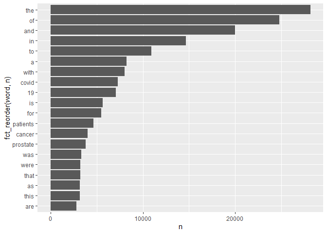
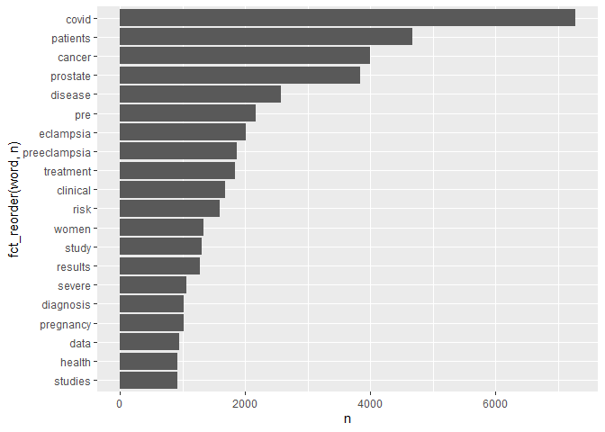
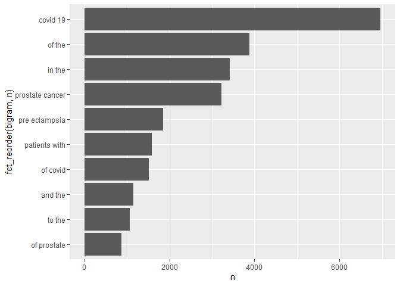
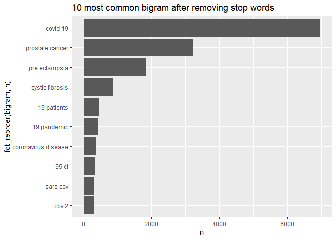

assignment03
================
Yuwei Wu
2022-11-03

# APIs

## 1. Using the NCBI API, look for papers that show up under the term “sars-cov-2 trial vaccine.” Look for the data in the pubmed database, and then retrieve the details of the paper as shown in lab 7. How many papers were you able to find?

``` r
# Downloading the website
website <- xml2::read_html("https://pubmed.ncbi.nlm.nih.gov/?term=sars-cov-2+trial+vaccine")
# Finding the counts
counts <- xml2::xml_find_first(website, "/html/body/main/div[9]/div[2]/div[2]/div[1]/div[1]/span")
# Turning it into text
counts <- as.character(counts)
# Extracting the data using regex
stringr::str_extract(counts, "[0-9,]+")
```

    ## [1] "4,007"

I find 4007 papers under the term “sars-cov-2 trial vaccine”.

## 2. Using the list of pubmed ids you retrieved, download each papers’ details using the query parameter rettype = abstract. If you get more than 250 ids, just keep the first 250.

``` r
query_ids <- GET(
  url   = "https://eutils.ncbi.nlm.nih.gov/entrez/eutils/esearch.fcgi",
  query = list(
              db = "pubmed",
              term = "sars-cov-2 trial vaccine",
              retmax = 250)
)
# Extracting the content of the response of GET
ids <- httr::content(query_ids)
# Turn the result into a character vector
ids <- as.character(ids)
# Find all the ids 
ids <- stringr::str_extract_all(ids, "<Id>[[:digit:]]+</Id>")[[1]]
# Remove all the leading and trailing <Id> </Id>. Make use of "|"
ids <- stringr::str_remove_all(ids, "</?Id>")
```

``` r
publications <- GET(
  url   = "https://eutils.ncbi.nlm.nih.gov/entrez/eutils/efetch.fcgi",
  query = list(
    db = "pubmed",
    id =I(paste(ids,collapse=",")),
    retmax = 250,
    rettype = "abstract"
    )
)

# Turning the output into character vector
publications <- httr::content(publications)
publications_txt <- as.character(publications)
```

## 3. As we did in lab 7. Create a dataset containing the following:

Pubmed ID number, Title of the paper, Name of the journal where it was
published, Publication date, and Abstract of the paper (if any).

``` r
pub_char_list <- xml2::xml_children(publications)
pub_char_list <- sapply(pub_char_list, as.character)
```

Get the titles:

``` r
titles <- str_extract(pub_char_list, "<ArticleTitle>[[:print:][:space:]]+</ArticleTitle>")
titles <- str_remove_all(titles, "</?[[:alnum:]- =\"]+>")
```

Get the name of the journal:

``` r
journal <- str_extract(pub_char_list, "<Title>[[:print:][:space:]]+</Title>")
journal <- str_remove_all(journal, "</?[[:alnum:]]+>")
```

Get the publication date:

``` r
date <- str_extract(pub_char_list, "<PubDate>[[:print:][:space:]]+</PubDate>")
date <- str_remove_all(date, "</?[[:alnum:]]+>")
date <- str_replace_all(date, "\\s+", " ")
```

Get the abstract of the paper:

``` r
abstracts <- str_extract(pub_char_list, "<Abstract>[[:print:][:space:]]+</Abstract>")
abstracts <- str_remove_all(abstracts, "</?[[:alnum:]- =\"]+>")  #'</?[[:alnum:]- ="]+>'
abstracts <- str_replace_all(abstracts, "[[:space:]]+"," ")
```

Finally the dataset:

``` r
database <- data.frame(
  PubMedId = ids,
  Title    = titles,
  Journal = journal,
  Date = date,
  Abstract = abstracts
)
knitr::kable(database[1:8,], caption = "Some papers about sars-cov-2 trial vaccine")
```

| PubMedId | Title                                                                                                                                                                                                                 | Journal                                           | Date        | Abstract                                                                                                                                                                                                                                                                                                                                                                                                                                                                                                                                                                                                                                                                                                                                                                                                                                                                                                                                                                                                                                                                                                                                                                                                                                                                                                                                                                                                                                                                                                                                                                                                                                                                                                                                                                                                                                                                                                                                                                                                                                                                                                                                                                                                                                                                                                                                                                                                                                                                                                                                                                                                                                                                                                                                                                                                                                                                                                                                                                                                                                                                                                                                                                                                                                                                                                                                                                                                                                                                                                                                                                                                                                                                                                                                                                           |
|:---------|:----------------------------------------------------------------------------------------------------------------------------------------------------------------------------------------------------------------------|:--------------------------------------------------|:------------|:-----------------------------------------------------------------------------------------------------------------------------------------------------------------------------------------------------------------------------------------------------------------------------------------------------------------------------------------------------------------------------------------------------------------------------------------------------------------------------------------------------------------------------------------------------------------------------------------------------------------------------------------------------------------------------------------------------------------------------------------------------------------------------------------------------------------------------------------------------------------------------------------------------------------------------------------------------------------------------------------------------------------------------------------------------------------------------------------------------------------------------------------------------------------------------------------------------------------------------------------------------------------------------------------------------------------------------------------------------------------------------------------------------------------------------------------------------------------------------------------------------------------------------------------------------------------------------------------------------------------------------------------------------------------------------------------------------------------------------------------------------------------------------------------------------------------------------------------------------------------------------------------------------------------------------------------------------------------------------------------------------------------------------------------------------------------------------------------------------------------------------------------------------------------------------------------------------------------------------------------------------------------------------------------------------------------------------------------------------------------------------------------------------------------------------------------------------------------------------------------------------------------------------------------------------------------------------------------------------------------------------------------------------------------------------------------------------------------------------------------------------------------------------------------------------------------------------------------------------------------------------------------------------------------------------------------------------------------------------------------------------------------------------------------------------------------------------------------------------------------------------------------------------------------------------------------------------------------------------------------------------------------------------------------------------------------------------------------------------------------------------------------------------------------------------------------------------------------------------------------------------------------------------------------------------------------------------------------------------------------------------------------------------------------------------------------------------------------------------------------------------------------------------------|
| 36322837 | Covid-19 Vaccine Protection among Children and Adolescents in Qatar.                                                                                                                                                  | The New England journal of medicine               | 2022 Nov 02 | The BNT162b2 vaccine against coronavirus disease 2019 (Covid-19) has been authorized for use in children 5 to 11 years of age and adolescents 12 to 17 years of age but in different antigen doses. We assessed the real-world effectiveness of the BNT162b2 vaccine against infection with severe acute respiratory syndrome coronavirus 2 (SARS-CoV-2) among children and adolescents in Qatar. To compare the incidence of SARS-CoV-2 infection in the national cohort of vaccinated participants with the incidence in the national cohort of unvaccinated participants, we conducted three matched, retrospective, target-trial, cohort studies - one assessing data obtained from children 5 to 11 years of age after the B.1.1.529 (omicron) variant became prevalent and two assessing data from adolescents 12 to 17 years of age before the emergence of the omicron variant (pre-omicron study) and after the omicron variant became prevalent. Associations were estimated with the use of Cox proportional-hazards regression models. Among children, the overall effectiveness of the 10-μg primary vaccine series against infection with the omicron variant was 25.7% (95% confidence interval \[CI\], 10.0 to 38.6). Effectiveness was highest (49.6%; 95% CI, 28.5 to 64.5) right after receipt of the second dose but waned rapidly thereafter and was negligible after 3 months. Effectiveness was 46.3% (95% CI, 21.5 to 63.3) among children 5 to 7 years of age and 16.6% (95% CI, -4.2 to 33.2) among those 8 to 11 years of age. Among adolescents, the overall effectiveness of the 30-μg primary vaccine series against infection with the omicron variant was 30.6% (95% CI, 26.9 to 34.1), but many adolescents had been vaccinated months earlier. Effectiveness waned over time since receipt of the second dose. Effectiveness was 35.6% (95% CI, 31.2 to 39.6) among adolescents 12 to 14 years of age and 20.9% (95% CI, 13.8 to 27.4) among those 15 to 17 years of age. In the pre-omicron study, the overall effectiveness of the 30-μg primary vaccine series against SARS-CoV-2 infection among adolescents was 87.6% (95% CI, 84.0 to 90.4) and waned relatively slowly after receipt of the second dose. Vaccination in children was associated with modest, rapidly waning protection against omicron infection. Vaccination in adolescents was associated with stronger, more durable protection, perhaps because of the larger antigen dose. (Funded by Weill Cornell Medicine-Qatar and others.). Copyright © 2022 Massachusetts Medical Society.                                                                                                                                                                                                                                                                                                                                                                                                                                                                                                                                                                                                                                                                                                                                                                                                                                                                                                                                                                                                                                                                                                                                                                                     |
| 36320825 | Withholding methotrexate after vaccination with ChAdOx1 nCov19 in patients with rheumatoid or psoriatic arthritis in India (MIVAC I and II): results of two, parallel, assessor-masked, randomised controlled trials. | The Lancet. Rheumatology                          | 2022 Nov    | There is a necessity for an optimal COVID-19 vaccination strategy for vulnerable population groups, including people with autoimmune inflammatory arthritis on immunosuppressants such as methotrexate, which inhibit vaccine-induced immunity against SARS-CoV-2. Thus, we aimed to assess the effects of withholding methotrexate for 2 weeks after each dose of ChAdOx1 nCov-19 (Oxford-AstraZeneca) vaccine (MIVAC I) or only after the second dose of vaccine (MIVAC II) compared with continuation of methotrexate, in terms of post-vaccination antibody titres and disease flare rates. MIVAC I and II were two parallel, independent, assessor-masked, randomised trials. The trials were done at a single centre (Dr Shenoy’s Centre for Arthritis and Rheumatism Excellence; Kochi, India) in people with either rheumatoid arthritis or psoriatic arthritis with stable disease activity, who had been on a fixed dose of methotrexate for the preceding 6 weeks. Those with previous COVID-19 or who were positive for anti-SARS-CoV-2 nucleocapsid antibodies were excluded from the trials. People on high-dose corticosteroids and rituximab were also excluded, whereas other disease-modifying antirheumatic drugs were allowed. In MIVAC I, participants were randomly assigned (1:1) to stop methotrexate treatment for 2 weeks after each vaccine dose or to continue methotrexate treatment. In MIVAC II, participants who had continued methotrexate during the first dose of vaccine were randomly assigned (1:1) to withhold methotrexate for 2 weeks after the second dose of vaccine or to continue to take methotrexate. The treating physician was masked to the group assignments. The primary outcome for both MIVAC I and MIVAC II was the titre (absolute value) of anti-receptor binding domain (RBD) antibody measured 4 weeks after the second dose of vaccine. All analyses were done per protocol. The trials were registered with the Clinical Trials Registry- India, number CTRI/2021/07/034639 (MIVAC I) and CTRI/2021/07/035307 (MIVAC II). Between July 6 and Dec 15, 2021, participants were recruited to the trials. In MIVAC I, 250 participants were randomly assigned and 158 completed the study as per the protocol (80 in the methotrexate hold group and 78 in the control group; 148 \[94%\] were women and 10 \[6%\] were men). The median post-vaccination antibody titres in the methotrexate hold group were significantly higher compared with the control group (2484·0 IU/mL, IQR 1050·0-4388·8 vs 1147·5 IU/mL, 433·5-2360·3; p=0·0014). In MIVAC II, 178 participants were randomly assigned and 157 completed the study per protocol (76 in the methotrexate hold group and 81 in the control group; 135 \[86%\] were women and 22 \[14%\] were men). The methotrexate hold group had higher post-vaccination antibody titres compared with the control group (2553·5 IU/ml, IQR 1792·5-4823·8 vs 990·5, 356·1-2252·5; p\<0·0001). There were no reports of any serious adverse events during the trial period. Withholding methotrexate after both ChAdOx1 nCov-19 vaccine doses and after only the second dose led to higher anti-RBD antibody titres compared with continuation of methotrexate. However, withholding methotrexate only after the second vaccine dose resulted in a similar humoral response to holding methotrexate after both vaccine doses, without an increased risk of arthritis flares. Hence, interruption of methotrexate during the second dose of ChAdOx1 nCov-19 vaccine appears to be a safe and effective strategy to improve the antibody response in patients with rheumatoid or psoriatic arthritis. Indian Rheumatology Association. © 2022 Elsevier Ltd. All rights reserved. |
| 36314847 | An online community peer support intervention to promote COVID-19 vaccine information among essential workers: a randomized trial.                                                                                    | Annals of medicine                                | 2022 Dec    | Vaccine hesitancy is still rampant in the United States, including health care personnel. Vaccination of frontline essential workers (e.g. health care workers) is very important, especially during a pandemic. We tested the efficacy of a 4-week online, peer-led intervention (Harnessing Online Peer Education) to promote requests for COVID-19 vaccine information among essential workers. Participants (N = 120) and peer leaders (N = 12) were recruited through online advertisements from July 23 to August 20, 2021. Eligibility criteria included: 18 years or older, U.S. resident, English speaker, part of phase 1a or 1 b of COVID-19 vaccine rollout (e.g. frontline essential workers), hadn’t received a COVID-19 vaccine but able to receive one. This was a parallel assignment randomised trial. STATA was used to create a randomisation using a random number generator so that all possible assignments of participants and peer leaders to groups were equally likely. Participants were randomly assigned to intervention or control arms that consisted of two private, hidden Facebook groups, each with 30 participants. Peer leaders were randomly assigned to an intervention group, each with six peer leaders. Participants in the intervention arm were randomly assigned to three peer leaders. Participants were blinded after assignment. Peer leaders were tasked with reaching out to their assigned participants at least three times each week. Participants completed a baseline and a post intervention survey. The study is registered on ClinicalTrials.org under identifier NCT04376515 and is no longer recruiting. This work was supported by the NIAID under grant 5R01AI132030-05. A total of 101 participants analysed (50 intervention and 51 control). Six people in the intervention group and 0 people in the control group requested vaccine information. Ten people in the intervention group and six people in the control group provided proof of vaccination. The odds of requesting vaccine information in the intervention group was 13 times that in the control group (95% confidence interval: (1.5, 1772), p-value = 0.015). Thirty-seven participants in the intervention group and 31 in the control group were engaged at some point during the study. Results suggest peer-led online community groups may help to disseminate health information, aid public health efforts, and combat vaccine hesitancy. Key MessagesThe odds of requesting vaccine information was 13 times in the intervention group.Peer-led online communities may help to disseminate information and aid public health efforts to combat vaccine hesitancy.                                                                                                                                                                                                                                                                                                                                                                                                                                                                                                                                                                                                                                                                                                                                                                                                                                                                                                                                                                                                                                                                      |
| 36307830 | Improving pediatric COVID-19 vaccine uptake using an mHealth tool (MoVeUp): study protocol for a randomized, controlled trial.                                                                                        | Trials                                            | 2022 Oct 28 | Coronavirus disease 2019 (COVID-19) vaccines demonstrate excellent effectiveness against infection, severe disease, and death. However, pediatric COVID-19 vaccination rates lag among individuals from rural and other medically underserved communities. The research objective of the current protocol is to determine the effectiveness of a vaccine communication mobile health (mHealth) application (app) on parental decisions to vaccinate their children against COVID-19. Custodial parents/caregivers with ≥ 1 child eligible for COVID-19 vaccination who have not yet received the vaccine will be randomized to download one of two mHealth apps. The intervention app will address logistical and motivational barriers to pediatric COVID-19 vaccination. Participants will receive eight weekly push notifications followed by two monthly push notifications (cues to action) regarding vaccinating their child. Through branching logic, users will access customized content based on their locality, degree of rurality-urbanicity, primary language (English/Spanish), race/ethnicity, and child’s age to address COVID-19 vaccine knowledge and confidence gaps. The control app will provide push notifications and information on general pediatric health and infection prevention and mitigation strategies based on recommendations from the American Academy of Pediatrics (AAP) and the Centers for Disease Control and Prevention (CDC). The primary outcome is the proportion of children who complete COVID-19 vaccination series. Secondary outcomes include the proportion of children who receive ≥ 1 dose of COVID-19 vaccine and changes in parent/caregiver scores from baseline to immediately post-intervention on the modified WHO SAGE Vaccine Hesitancy Scale adapted for the COVID-19 vaccine. The COVID-19 pandemic inflicts disproportionate harm on individuals from underserved communities, including those in rural settings. Maximizing vaccine uptake in these communities will decrease infection rates, severe illness, and death. Given that most US families from these communities use smart phones, mHealth interventions hold the promise of broad uptake. Bundling multiple mHealth vaccine uptake interventions into a single app may maximize the impact of deploying such a tool to increase COVID-19 vaccination. The new knowledge to be gained from this study will directly inform future efforts to increase COVID-19 vaccination rates across diverse settings and provide an evidentiary base for app-based vaccine communication tools that can be adapted to future vaccine-deployment efforts. ClinicalTrials.gov NCT05386355 . Registered on May 23, 2022. © 2022. The Author(s).                                                                                                                                                                                                                                                                                                                                                                                                                                                                                                                                                                                                                                                                                                                                                                                                                                                                                                                                                                                                                      |
| 36305195 | Deep learning in drug discovery: a futuristic modality to materialize the large datasets for cheminformatics.                                                                                                         | Journal of biomolecular structure & dynamics      | 2022 Oct 28 | Artificial intelligence (AI) development imitates the workings of the human brain to comprehend modern problems. The traditional approaches such as high throughput screening (HTS) and combinatorial chemistry are lengthy and expensive to the pharmaceutical industry as they can only handle a smaller dataset. Deep learning (DL) is a sophisticated AI method that uses a thorough comprehension of particular systems. The pharmaceutical industry is now adopting DL techniques to enhance the research and development process. Multi-oriented algorithms play a crucial role in the processing of QSAR analysis, de novo drug design, ADME evaluation, physicochemical analysis, preclinical development, followed by clinical trial data precision. In this study, we investigated the performance of several algorithms, including deep neural networks (DNN), convolutional neural networks (CNN) and multi-task learning (MTL), with the aim of generating high-quality, interpretable big and diverse databases for drug design and development. Studies have demonstrated that CNN, recurrent neural network and deep belief network are compatible, accurate and effective for the molecular description of pharmacodynamic properties. In Covid-19, existing pharmacological compounds has also been repurposed using DL models. In the absence of the Covid-19 vaccine, remdesivir and oseltamivir have been widely employed to treat severe SARS-CoV-2 infections. In conclusion, the results indicate the potential benefits of employing the DL strategies in the drug discovery process.Communicated by Ramaswamy H. Sarma.                                                                                                                                                                                                                                                                                                                                                                                                                                                                                                                                                                                                                                                                                                                                                                                                                                                                                                                                                                                                                                                                                                                                                                                                                                                                                                                                                                                                                                                                                                                                                                                                                                                                                                                                                                                                                                                                                                                                                                                                                                                                                                                                 |
| 36301821 | Immunogenicity and reactogenicity of SARS-CoV-2 vaccines in people living with HIV in the Netherlands: A nationwide prospective cohort study.                                                                         | PLoS medicine                                     | 2022 Oct    | Vaccines can be less immunogenic in people living with HIV (PLWH), but for SARS-CoV-2 vaccinations this is unknown. In this study we set out to investigate, for the vaccines currently approved in the Netherlands, the immunogenicity and reactogenicity of SARS-CoV-2 vaccinations in PLWH. We conducted a prospective cohort study to examine the immunogenicity of BNT162b2, mRNA-1273, ChAdOx1-S, and Ad26.COV2.S vaccines in adult PLWH without prior COVID-19, and compared to HIV-negative controls. The primary endpoint was the anti-spike SARS-CoV-2 IgG response after mRNA vaccination. Secondary endpoints included the serological response after vector vaccination, anti-SARS-CoV-2 T-cell response, and reactogenicity. Between 14 February and 7 September 2021, 1,154 PLWH (median age 53 \[IQR 44-60\] years, 85.5% male) and 440 controls (median age 43 \[IQR 33-53\] years, 28.6% male) were included in the final analysis. Of the PLWH, 884 received BNT162b2, 100 received mRNA-1273, 150 received ChAdOx1-S, and 20 received Ad26.COV2.S. In the group of PLWH, 99% were on antiretroviral therapy, 97.7% were virally suppressed, and the median CD4+ T-cell count was 710 cells/μL (IQR 520-913). Of the controls, 247 received mRNA-1273, 94 received BNT162b2, 26 received ChAdOx1-S, and 73 received Ad26.COV2.S. After mRNA vaccination, geometric mean antibody concentration was 1,418 BAU/mL in PLWH (95% CI 1322-1523), and after adjustment for age, sex, and vaccine type, HIV status remained associated with a decreased response (0.607, 95% CI 0.508-0.725, p \< 0.001). All controls receiving an mRNA vaccine had an adequate response, defined as \>300 BAU/mL, whilst in PLWH this response rate was 93.6%. In PLWH vaccinated with mRNA-based vaccines, higher antibody responses were predicted by CD4+ T-cell count 250-500 cells/μL (2.845, 95% CI 1.876-4.314, p \< 0.001) or \>500 cells/μL (2.936, 95% CI 1.961-4.394, p \< 0.001), whilst a viral load \> 50 copies/mL was associated with a reduced response (0.454, 95% CI 0.286-0.720, p = 0.001). Increased IFN-γ, CD4+ T-cell, and CD8+ T-cell responses were observed after stimulation with SARS-CoV-2 spike peptides in ELISpot and activation-induced marker assays, comparable to controls. Reactogenicity was generally mild, without vaccine-related serious adverse events. Due to the control of vaccine provision by the Dutch National Institute for Public Health and the Environment, there were some differences between vaccine groups in the age, sex, and CD4+ T-cell counts of recipients. After vaccination with BNT162b2 or mRNA-1273, anti-spike SARS-CoV-2 antibody levels were reduced in PLWH compared to HIV-negative controls. To reach and maintain the same serological responses as HIV-negative controls, additional vaccinations are probably required. The trial was registered in the Netherlands Trial Register (NL9214). <https://www.trialregister.nl/trial/9214>.                                                                                                                                                                                                                                                                                                                                                                                                                                                                                                                                                                                                                                                                                                                                                               |
| 36299427 | Fluvoxamine for Outpatient Treatment of COVID-19: A Decentralized, Placebo-controlled, Randomized, Platform Clinical Trial.                                                                                           | medRxiv : the preprint server for health sciences | 2022 Oct 18 | The effectiveness of fluvoxamine to shorten symptom duration or prevent hospitalization among outpatients in the US with mild to moderate symptomatic coronavirus disease 2019 (COVID-19) is unclear. ACTIV-6 is an ongoing, decentralized, double-blind, randomized, placebo-controlled platform trial testing repurposed medications in outpatients with mild to moderate COVID-19. A total of 1288 non-hospitalized adults aged ≥30 years with confirmed COVID-19 experiencing ≥2 symptoms of acute infection for ≤7 days prior to randomization were randomized to receive fluvoxamine 50 mg or placebo twice daily for 10 days. The primary outcome was time to sustained recovery, defined as the third of 3 consecutive days without symptoms. Secondary outcomes included composites of hospitalization or death with or without urgent or emergency care visit by day 28. Of 1331 participants randomized (mean \[SD\] age, 48.5 \[12.8\] years; 57% women; 67% reported receiving at least 2 doses of a SARS-CoV-2 vaccine), 1288 completed the trial (n=614 placebo, n=674 fluvoxamine). Median time to recovery was 13 days (IQR 12-13) in the placebo group and 12 days (IQR 11-14) in the fluvoxamine group (hazard ratio \[HR\] 0.96, 95% credible interval \[CrI\] 0.86-1.07; posterior probability for benefit \[HR\>1\]=0.22). Twenty-six participants (3.9%) in the fluvoxamine group were hospitalized or had urgent or emergency care visits compared with 23 (3.8%) in the placebo group (HR 1.1, 95% CrI 0.6-1.8; posterior probability for benefit \[HR\<1\]=0.340). One participant in the fluvoxamine group and 2 in the placebo group were hospitalized; no deaths occurred. Adverse events were uncommon in both groups. Treatment with fluvoxamine 50 mg twice daily for 10 days did not improve time to recovery, compared with placebo, among outpatients with mild to moderate COVID-19. These findings do not support the use of fluvoxamine at this dose and duration in patients with mild to moderate COVID-19.                                                                                                                                                                                                                                                                                                                                                                                                                                                                                                                                                                                                                                                                                                                                                                                                                                                                                                                                                                                                                                                                                                                                                                                                                                                                                                                                                                                                                                                                                                                                                                                                                                                                                                                                |
| 36298743 | Immunogenicity, Safety, and Anti-Viral Efficacy of a Subunit SARS-CoV-2 Vaccine Candidate in Captive Black-Footed Ferrets (Mustela nigripes) and Their Susceptibility to Viral Challenge.                             | Viruses                                           | 2022 Oct 04 | A preliminary vaccination trial against the emergent pathogen, SARS-CoV-2, was completed in captive black-footed ferrets (Mustela nigripes; BFF) to assess safety, immunogenicity, and anti-viral efficacy. Vaccination and boosting of 15 BFF with purified SARS-CoV-2 S1 subunit protein produced a nearly 150-fold increase in mean antibody titers compared to pre-vaccination titers. Serum antibody responses were highest in young animals, but in all vaccinees, antibody response declined rapidly. Anti-viral activity from vaccinated and unvaccinated BFF was determined in vitro, as well as in vivo with a passive serum transfer study in mice. Transgenic mice that received BFF serum transfers and were subsequently challenged with SARS-CoV-2 had lung viral loads that negatively correlated (p &lt; 0.05) with the BFF serum titer received. Lastly, an experimental challenge study in a small group of BFF was completed to test susceptibility to SARS-CoV-2. Despite viral replication and shedding in the upper respiratory tract for up to 7 days post-challenge, no clinical disease was observed in either vaccinated or naive animals. The lack of morbidity or mortality observed indicates SARS-CoV-2 is unlikely to affect wild BFF populations, but infected captive animals pose a potential risk, albeit low, for humans and other animals.                                                                                                                                                                                                                                                                                                                                                                                                                                                                                                                                                                                                                                                                                                                                                                                                                                                                                                                                                                                                                                                                                                                                                                                                                                                                                                                                                                                                                                                                                                                                                                                                                                                                                                                                                                                                                                                                                                                                                                                                                                                                                                                                                                                                                                                                                                                                                                                                   |

Some papers about sars-cov-2 trial vaccine

# Text Mining

A new dataset has been added to the data science data repository
<https://github.com/USCbiostats/data-science-data/tree/master/03_pubmed>.
The dataset contains 3241 abstracts from articles across 5 search terms.
Your job is to analyse these abstracts to find interesting insights.

``` r
pubmed <- read.csv("https://raw.githubusercontent.com/USCbiostats/data-science-data/master/03_pubmed/pubmed.csv")
```

## 1. Tokenize the abstracts and count the number of each token. Do you see anything interesting? Does removing stop words change what tokens appear as the most frequent? What are the 5 most common tokens for each search term after removing stopwords?

Tokenize words in transcription and look at top 20:

``` r
pubmed %>%
  unnest_tokens(output=word, input=abstract) %>%
  count(word, sort = TRUE) %>%
  top_n(20, n) %>%
  ggplot(aes(x=n, y=fct_reorder(word, n))) +
  geom_col()
```

<!-- -->

There are a lot of stop words here. The top 5 words are “the”, “of”,
“and”, “in” and “to”.

Then remove stop words:

``` r
pubmed %>%
  unnest_tokens(output=word, input=abstract) %>%
  count(word, sort = TRUE) %>%  
  anti_join(stop_words, by="word")%>%
  filter(!grepl(pattern = "^[0-9]+$", x=word)) %>%
  top_n(20, n) %>%
  ggplot(aes(x=n, y=fct_reorder(word, n))) +
  geom_col()
```

<!-- -->

After removing stop words, these words look more like medical terms.

The 5 most common tokens for each search term after removing stopwords:

``` r
pubmed %>% 
  unnest_tokens(output=token, input=abstract)%>%
  group_by(term)%>%
  count(token)%>%
  anti_join(stop_words, by = c("token" = "word"))%>%
  top_n(5,n)%>%
  knitr::kable()
```

| term            | token        |    n |
|:----------------|:-------------|-----:|
| covid           | 19           | 7035 |
| covid           | covid        | 7275 |
| covid           | disease      |  943 |
| covid           | pandemic     |  800 |
| covid           | patients     | 2293 |
| cystic fibrosis | cf           |  625 |
| cystic fibrosis | cystic       |  862 |
| cystic fibrosis | disease      |  400 |
| cystic fibrosis | fibrosis     |  867 |
| cystic fibrosis | patients     |  586 |
| meningitis      | clinical     |  187 |
| meningitis      | csf          |  206 |
| meningitis      | meningeal    |  219 |
| meningitis      | meningitis   |  429 |
| meningitis      | patients     |  446 |
| preeclampsia    | eclampsia    | 2005 |
| preeclampsia    | pre          | 2038 |
| preeclampsia    | preeclampsia | 1863 |
| preeclampsia    | pregnancy    |  969 |
| preeclampsia    | women        | 1196 |
| prostate cancer | cancer       | 3840 |
| prostate cancer | disease      |  652 |
| prostate cancer | patients     |  934 |
| prostate cancer | prostate     | 3832 |
| prostate cancer | treatment    |  926 |

After removing stop words, the 5 most common tokens:

For the term “covid”: “19”, “covid”, “disease”, “pandemic” and
“patients”.

For the term “cystic fibrosis”: “cf”, “cystic”, “disease”, “fibrosis”
and “patients”.

For the term “meningitis”: “clinical”, “csf”, “meningeal”, “meningitis”
and “patients”.

For the term “preeclampsia”: “eclampsia”, “pre”, “preeclampsia”,
“pregnancy” and “women”.

For the term “prostate cancer”: “cancer”, “disease”, “patients”,
“prostate” and “treatment”.

## 2. Tokenize the abstracts into bigrams. Find the 10 most common bigram and visualize them with ggplot2.

``` r
pubmed %>%
  unnest_ngrams(output=bigram, input=abstract, n=2) %>%
  count(bigram, sort=TRUE) %>%
  top_n(10, n) %>%
  ggplot(aes(x=n, y=fct_reorder(bigram, n))) +
  geom_col()
```

<!-- -->

“covid 19” was the top bigram, but there are a lot of non-interesting
bigrams (of the, in the). So remove these stop words：

``` r
bigram <- pubmed %>%
  unnest_ngrams(output=bigram, input=abstract, n=2) %>% 
  separate(col=bigram, into=c("word1", "word2"), sep = " ") %>%
  select(word1, word2) %>%
  anti_join(stop_words, by = c("word1" = "word")) %>%
  anti_join(stop_words, by = c("word2" = "word")) %>%
  count(word1, word2, sort=TRUE) %>%
  top_n(10, n)
```

``` r
bigram$bigram <- paste(bigram$word1, bigram$word2)
bigram %>%
  ggplot(aes(n, fct_reorder(bigram,n))) + 
  geom_col() +
  labs(title = "10 most common bigram after removing stop words")
```

<!-- -->

After removing stop words, the 10 common bigrams are “covid 19”,
“prostate cancer”, “pre eclampsia” and so on.

## 3. Calculate the TF-IDF value for each word-search term combination. (here you want the search term to be the “document”) What are the 5 tokens from each search term with the highest TF-IDF value? How are the results different from the answers you got in question 1?

``` r
pubmed %>%
  unnest_tokens(word, abstract) %>%
  count(word, term) %>%
  bind_tf_idf(word, term, n) %>%
  group_by(term)%>%
  top_n(5,tf_idf)%>%
  arrange(desc(tf_idf), .by_group = TRUE)%>%
  knitr::kable()
```

| word            | term            |    n |        tf |       idf |    tf_idf |
|:----------------|:----------------|-----:|----------:|----------:|----------:|
| covid           | covid           | 7275 | 0.0371050 | 1.6094379 | 0.0597183 |
| pandemic        | covid           |  800 | 0.0040803 | 1.6094379 | 0.0065670 |
| coronavirus     | covid           |  647 | 0.0032999 | 1.6094379 | 0.0053110 |
| sars            | covid           |  372 | 0.0018973 | 1.6094379 | 0.0030536 |
| cov             | covid           |  334 | 0.0017035 | 1.6094379 | 0.0027417 |
| cf              | cystic fibrosis |  625 | 0.0127188 | 0.9162907 | 0.0116541 |
| fibrosis        | cystic fibrosis |  867 | 0.0176435 | 0.5108256 | 0.0090127 |
| cystic          | cystic fibrosis |  862 | 0.0175417 | 0.5108256 | 0.0089608 |
| cftr            | cystic fibrosis |   86 | 0.0017501 | 1.6094379 | 0.0028167 |
| sweat           | cystic fibrosis |   83 | 0.0016891 | 1.6094379 | 0.0027184 |
| meningitis      | meningitis      |  429 | 0.0091942 | 1.6094379 | 0.0147974 |
| meningeal       | meningitis      |  219 | 0.0046935 | 1.6094379 | 0.0075539 |
| pachymeningitis | meningitis      |  149 | 0.0031933 | 1.6094379 | 0.0051394 |
| csf             | meningitis      |  206 | 0.0044149 | 0.9162907 | 0.0040453 |
| meninges        | meningitis      |  106 | 0.0022718 | 1.6094379 | 0.0036562 |
| eclampsia       | preeclampsia    | 2005 | 0.0142784 | 1.6094379 | 0.0229802 |
| preeclampsia    | preeclampsia    | 1863 | 0.0132672 | 1.6094379 | 0.0213527 |
| pregnancy       | preeclampsia    |  969 | 0.0069006 | 0.5108256 | 0.0035250 |
| maternal        | preeclampsia    |  797 | 0.0056757 | 0.5108256 | 0.0028993 |
| gestational     | preeclampsia    |  191 | 0.0013602 | 1.6094379 | 0.0021891 |
| prostate        | prostate cancer | 3832 | 0.0311890 | 1.6094379 | 0.0501967 |
| androgen        | prostate cancer |  305 | 0.0024824 | 1.6094379 | 0.0039953 |
| psa             | prostate cancer |  282 | 0.0022952 | 1.6094379 | 0.0036940 |
| prostatectomy   | prostate cancer |  215 | 0.0017499 | 1.6094379 | 0.0028164 |
| castration      | prostate cancer |  148 | 0.0012046 | 1.6094379 | 0.0019387 |

The 5 most common tokens:

For the term “covid”: “covid”, “pandemic”, “coronavirus”, “sars” and
“cov”.

For the term “cystic fibrosis”: “cf”, “fibrosis”, “cystic”, “cftr” and
“sweat”.

For the term “meningitis”: “meningitis”, “meningeal”, “pachymeningitis”,
“csf” and “meninges”.

For the term “preeclampsia”: “eclampsia”, “preeclampsia”, “pegnancy”,
“maternal” and “gestational”.

For the term “prostate cancer”: “prostate”, “androgen”, “psa”,
“prostatectomy” and “castration”.

Compared to question 1, although there are many same words, but TF-IDF
may have provides more scientific terms which showed more information
that were specifically related to our word-search term.
